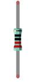

##############################################################################
Chapter Motor
##############################################################################

Earlier, we have done a series of interesting projects with control board and basic electronic components. Now, let us study some movable electronic modules. In this chapter, we will learn to control a motor.

Project Control Motor by Relay
***************************************************************

First, use relay to control a Motor.

Component List
===============================================================

+------------------------------------+---------------------------------+
| Control board x1                   |Breadboard x1                    |
|                                    |                                 |
|  |Chapter01_00|                    |  |Chapter01_01|                 |
+------------------------------------+---------------------------------+
| USB cable x1                       | Jumper M/M x2                   |
|                                    |                                 |
|  |Chapter01_02|                    |  |Chapter01_06|                 |
+------------------------------------+---------------------------------+
|  AA Battery holder x1              | Resistor 10kΩ x2                |
|                                    |                                 |
|  (Need AA battery x2)              |                                 |
|                                    |                                 |
|  |Chapter10_00|                    |  |Chapter05_00|                 |
+------------------------------------+---------------------------------+
| Resistor 1kΩ x1                    | Resistor 220Ω x1                |
|                                    |                                 |
|  |Chapter09_02|                    |  |Chapter01_04|                 |
+------------------------------------+---------------------------------+
| NPN transistor x1                  | Relay x1                        |
|                                    |                                 |
|  |Chapter09_00|                    |  |Chapter10_01|                 |
+------------------------------------+---------------------------------+
| Motor x1                           | Push button x1                  |
|                                    |                                 |
|  |Chapter10_02|                    |  |Chapter01_05|                 |
+------------------------------------+---------------------------------+
| LED x1                             | Diode x1                        |
|                                    |                                 |
|  |Chapter01_03|                    |  |Chapter10_03|                 |
+------------------------------------+---------------------------------+

.. |Chapter01_00| image:: ../_static/imgs/1_LED_Blink/Chapter01_00.png
.. |Chapter01_01| image:: ../_static/imgs/1_LED_Blink/Chapter01_01.png

.. |Chapter09_02| image:: ../_static/imgs/9_Buzzer/Chapter09_02.png

.. |Chapter09_00| image:: ../_static/imgs/9_Buzzer/Chapter09_00.png

.. |Chapter01_02| image:: ../_static/imgs/1_LED_Blink/Chapter01_02.png

.. |Chapter01_03| image:: ../_static/imgs/1_LED_Blink/Chapter01_03.png

Component Knowledge
===============================================================

DC Motor
---------------------------------------------------------------

DC Motor is a device that converts electrical energy into mechanical energy. DC Motors consist of two major parts, a Stator and the Rotor. The stationary part of a DC Motor is the Stator and the part that Rotates is the Rotor. The Stator is usually part of the outer case of motor (if it is simply a pair of permanent magnets), and it has terminals to connect to the power if it is made up of electromagnet coils. Most Hobby DC Motors only use Permanent Magnets for the Stator Field. The Rotor is usually the shaft of motor with 3 or more electromagnets connected to a commutator where the brushes (via the terminals 1 & 2 below) supply electrical power, which can drive other mechanical devices. The diagram below shows a small DC Motor with two terminal pins.

When a DC Motor is connected to a power supply, it will rotate in one direction. If you reverse the polarity of the power supply, the DC Motor will rotate in opposite direction. This is important to note.

Capacitor
---------------------------------------------------------------

The unit of capacitance(C) is farad (F). 1F=1000000μF, 1μF=1000000pF.

A Capacitor is an energy storage device, with a certain capacitance. When capacitor’s voltage increases, the capacitor will be charged. And capacitor will be discharged when its voltage drops. So capacitor’s voltage of both ends is not transient. According to this characteristic, capacitor is often used to stabilize the voltage of power supply, and filter the signal. Capacitor with large capacity can filter out low frequency signals, and small-capacity capacitor can filter out high frequency signals.

The capacitor has a non-polar capacitor and a polar capacitor. Generally, non-polar capacitor has small capacitance, and a ceramic non-polar capacitor is shown below.

For polar capacitor, it usually has larger capacitance, and an electrolytic polar capacitor of that is shown below:

When the motor rotates, it will generate noise. As the contact of coil connects and disconnects the electrode constantly, it will cause the supply voltage unstable. Thus, a small capacitor is often connected to motor to reduce the impact on power supply from motor.

Relay
---------------------------------------------------------------

Relays are a type of Switch that open and close circuits electromechanically or electronically. Relays control one electrical circuit by opening and closing contacts in another circuit using an electromagnet to initiate the Switch action. When the electromagnet is energized (powered), it will attract internal contacts completing a circuit, which act as a Switch. Many times Relays are used to allow a low powered circuit (and a small low amperage switch) to safely turn ON a larger more powerful circuit. They are commonly found in automobiles, especially from the ignition to the starter motor.

The following is the image and circuit symbol diagram of the 5V relay used in this project:

Pin 5 and pin 6 are internally connected to each other. When the coil pin3 and pin 4 are connected to a 5V power supply, pin 1 will be disconnected from pins 5 & 6 and pin 2 will be connected to pins 5 & 6. Pin 1 is called Closed End and pin 2 is called the Open End.

Inductor
---------------------------------------------------------------

The symbol of inductance is “L” and the unit of inductance is the “Henry” (H). Here is an example of how this can be encountered: 1H=1000mH, 1mH=1000μH.

An inductor is a passive device that stores energy in its magnetic field and returns energy to the circuit whenever required. An inductor is formed by a Cylindrical Core with many turns of conducting wire (usually copper wire). Inductors will hinder the changing current passing through it. When the current passing through the inductor increases, it will attempt to hinder the increasing movement of current; and when the current passing through the inductor decreases, it will attempt to hinder the decreasing movement of current. So the current passing through an inductor is not transient.

The circuit for a relay is as follows: The coil of relay can be equivalent to an Inductor, when a transistor is present in this coil circuit it can disconnect the power to the relay, the current in the Relay's coil does not stop immediately, which affects the power supply adversely. To remedy this, diodes in parallel are placed on both ends of the relay coil pins in opposite polar direction. Having the current pass through the diodes will avoid any adverse effect on the power supply.

Circuit
---------------------------------------------------------------

Use pin 12 of control board to detect the state of push button switch, and pin 9 to control the relay. As the running of motor needs larger power, we will use two AA batteries to supply power for the motor alone.

.. list-table:: 
    :width: 100%
    :align: center

    *   -   Schematic diagram
    *   -   |Chapter10_11|

    *   -   Hardware connection
    *   -   |Chapter10_12|

Sketch
===============================================================

Sketch 10.1.1
---------------------------------------------------------------

Now, write code to detect the state of push button switch. Each time you press the button, the switching status of relay will change. So we control the motor to rotate or stop in this way.

.. literalinclude:: ../../../freenove_17_Kit/Sketches/Sketch_10.1.1_Control_Motor_by_Relay/Sketch_10.1.1_Control_Motor_by_Relay.ino
    :linenos: 
    :language: c

In this code, we used a new method to detect the button's state. In the loop() function, the level state of button pin is detected constantly. When the level is changed, record its time point. If the level has not changed after a while, it will be considered that the bounce area has already been skipped. Then, judge whether the button is pressed or released according to button pin state.

First, define two variables to record the state of the button and the relay.

.. code-block:: c

    int buttonState = HIGH;     // Record button state, initial the state into high level
    int relayState = LOW;       // Record relay state, initial the state into low level

Define a variable to record button pin's state of last detection.

.. code-block:: c

    int lastButtonState = HIGH; // Record the button state of last detection

Define a variable to record the time of the last button pin change.

.. code-block:: c

    long lastChangeTime = 0;    // Record the time point for button state change 

In the loop() function, the detected pin state of button will be compared with the last detected state. If it changes, record this time point.

.. code-block:: c

    void loop() {
        int nowButtonState = digitalRead(buttonPin); // Read current state of button pin
        // If the state of button pin has changed, record the time point
        if (nowButtonState != lastButtonState) {
            lastChangeTime = millis();
        }
        ...
        lastButtonState = nowButtonState; // Save the state of last button
    }

If the level stays unchanged over a period of time, it is considered that the bounce area has already been skipped.

  .. code-block:: c

    if (millis() - lastChangeTime > 10) {
       ...
    }

After the pin state stays stable, the changed state of button is confirmed, then it will be recorded for the next comparison.

.. code-block:: c

    if (buttonState != nowButtonState) {  // Confirm button state has changed
      buttonState = nowButtonState;
      ...
    }

Judge whether the button is pressed or released according to button pin level, print button information to serial port, and reverse relay when the button is pressed.

.. code-block:: c

    if (buttonState == LOW) {     // Low level indicates the button is pressed
        relayState = !relayState;           // Reverse relay state
        digitalWrite(relayPin, relayState); // Update relay state
        Serial.println("Button is Pressed!");
    }
    else {                        // High level indicates the button is released
        Serial.println("Button is Released!");
    }

This button detecting method does not put program into the state of delay waiting, you can increase the efficiency of code execution.

.. py:function:: millis()

    Returns the number of milliseconds since the control board began running the current program.

Verify and upload the code, every time you press the push button, the state of relay and motor changes once.

Project Control Motor with L293D
***************************************************************

Now, we will use dedicated chip L293D to control the motor.

Component List
===============================================================

+------------------------------------+---------------------------------+
| Control board x1                   | Breadboard x1                   |
|                                    |                                 |
|  |Chapter01_00|                    |  |Chapter01_01|                 |
+------------------------------------+---------------------------------+
| USB cable x1                       | Rotary potentiometer x1         |
|                                    |                                 |
|  |Chapter01_02|                    |  |Chapter07_00|                 |
+------------------------------------+---------------------------------+
|  AA Battery holder x1              | Jumper M/M x10                  |
|                                    |                                 |
|  (Need AA battery x2)              | Jumper F/M x2                   |
|                                    |                                 |
|  |Chapter10_00|                    |  |Chapter01_06|                 |
+------------------------------------+---------------------------------+
| Motor x1                           | L293D x1                        |
|                                    |                                 |
|  |Chapter10_02|                    |  |Chapter10_13|                 |
+------------------------------------+---------------------------------+

.. |Chapter07_00| image:: ../_static/imgs/7_ADC/Chapter07_00.png

Component Knowledge
===============================================================

L293D
---------------------------------------------------------------

L293D is an IC chip (Integrated Circuit Chip) with a 4-channel motor drive. You can drive a unidirectional DC motor with 4 ports or a bi-directional DC motor with 2 ports or a stepper motor (stepper motors are covered later in this Tutorial).

Port description of L293D module is as follows:

.. list-table:: 
    :width: 100%
    :align: center
    :header-rows: 1

    *   -   Pin name
        -   Pin number
        -   Description

    *   -   In x
        -   2, 7, 10, 15
        -   Channel x digital signal input pin

    *   -   Out x
        -   3, 6, 11, 14
        -   Channel x output pin, input high or low level according to In x pin
            
            , get connected to +Vmotor or 0V

    *   -   Enable1
        -   1
        -   Channel 1 and channel 2 enable pin, high level enable

    *   -   Enable2
        -   9
        -   Channel 3 and channel 4 enable pin, high level enable

    *   -   0V
        -   4, 5, 12, 13
        -   Power cathode (GND)

    *   -   +V
        -   16
        -   Positive electrode (VCC) of power supply, supply voltage 4.5~36V

    *   -   +Vmotor
        -   8
        -   Positive electrode of load power supply, provide power supply for the 
            
            Out pin x, the supply voltage is +V~36V

For more details, please see datasheet.

When using L293D to drive DC motor, there are usually two kinds of connection.

The following connection option uses one channel of the L239D, which can control motor speed through the PWM, However the motor then can only rotate in one direction.

The following connection uses two channels of the L239D: one channel outputs the PWM wave, and the other channel connects to GND. Therefore, you can control the speed of the motor. When these two channel signals are exchanged, not only controls the speed of motor, but also can control the speed of the motor.

In practical use the motor is usually connected to channel 1 and by outputting different levels to in1 and in2 to control the rotational direction of the motor, and output to the PWM wave to Enable1 port to control the motor’s rotational speed. If the motor is connected to channel 3 and 4 by outputting different levels to in3 and in4 to control the motor's rotation direction, and output to the PWM wave to Enable2 pin to control the motor's rotational speed.

Circuit
===============================================================

Use pin A0 of the control board to detect the voltage of rotary potentiometer; pin 9 and pin 10 to control the motor's rotation direction and pin 11 to output PWM wave to control motor speed.

.. list-table:: 
    :width: 100%
    :align: center

    *   -   Schematic diagram
    *   -   |Chapter10_17|

    *   -   Hardware connection
    *   -   |Chapter10_18|

Sketch
===============================================================

Sketch 10.2.1
---------------------------------------------------------------

Now, write the code to control speed and rotation direction of motor through rotary potentiometer. When the potentiometer stays in the middle position, motor speed will be minimum, and when deviates intermediate position, the speed will increase. Also, if the potentiometer deviates from the middle position of potentiometer clockwise or counterclockwise, the rotation direction of the motor is different.

.. literalinclude:: ../../../freenove_17_Kit/Sketches/Sketch_10.2.1_Control_Motor_by_L293D/Sketch_10.2.1_Control_Motor_by_L293D.ino
    :linenos: 
    :language: c

In the code, we write a function to control the motor, and control the speed and steering through two parameters.

.. literalinclude:: ../../../freenove_17_Kit/Sketches/Sketch_10.2.1_Control_Motor_by_L293D/Sketch_10.2.1_Control_Motor_by_L293D.ino
    :linenos: 
    :language: c
    :lines: 37-49

In the loop () function, detect the digital value of rotary potentiometer, and convert it into the motor speed and steering through calculation.

.. literalinclude:: ../../../freenove_17_Kit/Sketches/Sketch_10.2.1_Control_Motor_by_L293D/Sketch_10.2.1_Control_Motor_by_L293D.ino
    :linenos: 
    :language: c
    :lines: 23-35

.. py:function:: abs(x)

    Computes the absolute value of a number.

Verify and upload the code, turn the shaft of rotary potentiometer, and then you can see the change of the motor speed and direction. 