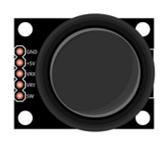
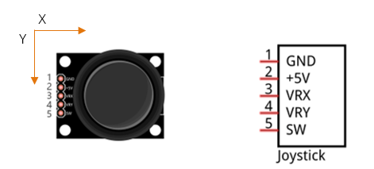
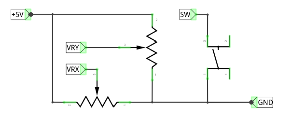
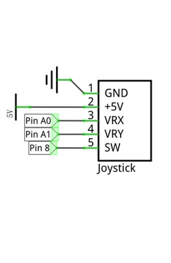
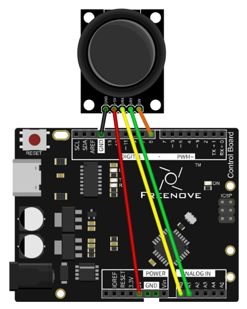
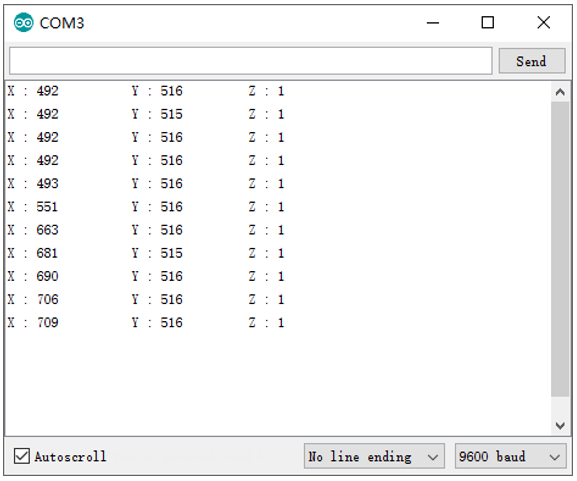

##############################################################################
Chapter Joystick
##############################################################################

In the previous chapter, we have learned how to use rotary potentiometer. Now, let us learn a new electronic module Joystick that works on the same principle as rotary potentiometer.

Project Joystick
***************************************************************

We will use the serial port to get Joystick data.

Component List
===============================================================

+------------------------------------+---------------------------------+
| Control board x1                   |Joystick x1                      |
|                                    |                                 |
|  |Chapter01_00|                    |  |Chapter13_00|                 |
+------------------------------------+---------------------------------+
| USB cable x1                       | Jumper M/M x6                   |
|                                    |                                 |
|  |Chapter01_02|                    |  |Chapter01_06|                 |
+------------------------------------+---------------------------------+

.. |Chapter01_00| image:: ../_static/imgs/1_LED_Blink/Chapter01_00.png
.. |Chapter01_02| image:: ../_static/imgs/1_LED_Blink/Chapter01_02.png
.. |Chapter01_06| image:: ../_static/imgs/1_LED_Blink/Chapter01_06.png

Component Knowledge
===============================================================

Joystick
---------------------------------------------------------------

A Joystick is a kind of input sensor used with your fingers. You should be familiar with this concept already as they are widely used in gamepads and remote controls. It can receive input on two axes (Y and or X) at the same time (usually used to control direction on a two dimensional plane). And it also has a third direction capability by pressing down (Z axis/direction).

This is accomplished by incorporating two rotary potentiometers inside the Joystick Module at 90 degrees of each other, placed in such a manner as to detect shifts in direction in two directions simultaneously and with a Push Button Switch in the “vertical” axis, which can detect when a User presses on the Joystick.

Circuit
===============================================================

Use pin A0 and pin A1 on control board to detect the voltage value of two rotary potentiometers inside Joystick, and use pin 8 port to detect the vertical button.

.. list-table:: 
    :width: 100%
    :align: center

    *   -   Schematic diagram
        -   Hardware connection

    *   -   |Chapter13_03|
        -   |Chapter13_04|

Sketch
===============================================================

Sketch 13.1.1
---------------------------------------------------------------

Now write the sketch to detect the voltage value of these two rotary potentiometers and the state of the button in vertical direction, then sent the data to Serial Monitor window.

.. literalinclude:: ../../../freenove_17_Kit/Sketches/Sketch_13.1.1_Joystick/Sketch_13.1.1_Joystick.ino
    :linenos: 
    :language: c

In the code, we get the ADC value of pin A0, A1 and the state of button, and then sent the data to serial port.

.. py:function:: INPUT_PULLUP

    Set the port to INPUT_PULLUP mode, which is equivalent to configuring the port to INPUT mode, then connect a resistor with high resistance value to VCC behind the port.
    
    Push button of joystick is left hanging when it is not pressed (connected to no circuits with certain voltage value). The results of push button port read by control board are not fixed. So we can set this port to INPUT_PULLUP mode. Then when the push button is not pressed, the state of the port is high. But if it is pressed, the state turns into low level.

Verify and upload the code, open the Serial Monitor, and you can see the Joystick state value sent by control board. Shift and press the rocker of joystick with your finger, and you can see the change of value.

