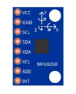
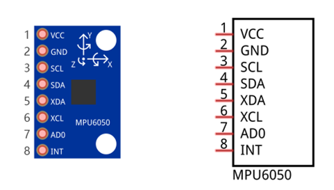
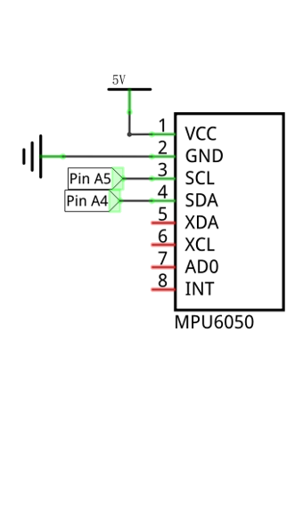
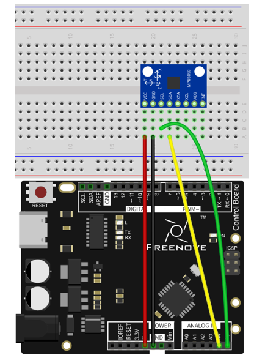
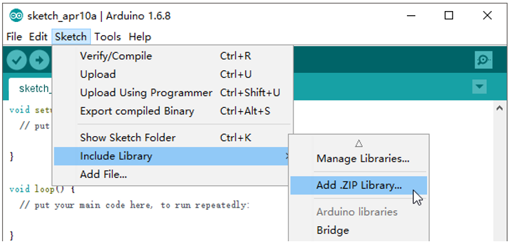
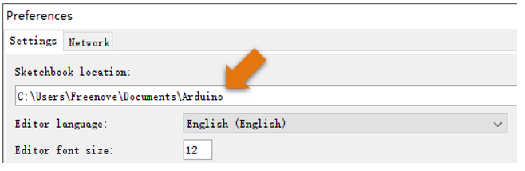
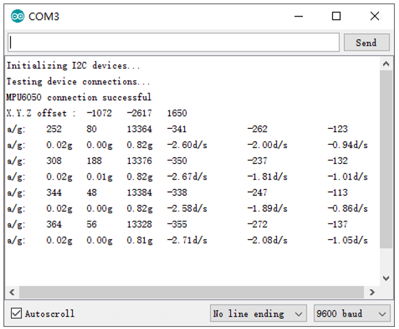

##############################################################################
Chapter Acceleration sensor
##############################################################################

In the previous chapter, we have learned sensors that are used to detect light or temperature. Now we will learn a sensor that can detect acceleration.

Project Acceleration Detection
***************************************************************

We will use serial port to get the data of MPU6050 module.

Component List
===============================================================

+-----------------------------------+---------------------------------------+
| Control board x1                  |  Breadboard x1                        |
|                                   |                                       |
|  |Chapter01_00_1|                 |   |Chapter01_01|                      |
+-----------------------------------+---------------------------------------+
| USB cable x1                      | MPU6050 module x1                     |
|                                   |                                       |
|  |Chapter01_02|                   |  |Chapter14_00|                       |
+-----------------------------------+                                       |
| Jumper M/M x3                     |                                       |
|                                   |                                       |
|  |Chapter01_06|                   |                                       |
+-----------------------------------+---------------------------------------+

.. |Chapter01_00_1| image:: ../_static/imgs/1_LED_Blink/Chapter01_00.png
.. |Chapter01_01| image:: ../_static/imgs/1_LED_Blink/Chapter01_01.png
    :width: 95%
.. |Chapter01_04| image:: ../_static/imgs/1_LED_Blink/Chapter01_04.png
.. |Chapter01_06| image:: ../_static/imgs/1_LED_Blink/Chapter01_06.png

.. |Chapter01_02| image:: ../_static/imgs/1_LED_Blink/Chapter01_02.png

Component Knowledge
===============================================================

I2C communication
---------------------------------------------------------------

I2C (Inter-Integrated Circuit) is a two-wire serial communication mode, which can be used to the connection of micro controller and its peripheral equipment. Devices using I2C communication must be connected to the serial data (SDA) line, and serial clock (SCL) line (called I2C bus). Each device has a unique address and can be used as a transmitter or receiver to communicate with devices connected to the bus.

MPU6050
---------------------------------------------------------------

MPU6050 Sensor Module is a complete 6-axis Motion Tracking Device. It combines a 3-axis Gyroscope, a 3-axis Accelerometer and a DMP (Digital Motion Processor) all in a small package. The settings of the Accelerometer and Gyroscope of MPU6050 can be changed. A precision wide range digital temperature sensor is also integrated to compensate data readings for changes in temperature, and temperature values can also be read. The MPU6050 Module follows the I2C communication protocol and the default address is 0x68.

The port description of the MPU6050 module is as follows:

.. list-table:: 
    :width: 70%
    :align: center
    :header-rows: 1

    *   -   Pin name
        -   Pin number
        -   Description

    *   -   VCC
        -   1
        -   Positive pole of power supply with voltage 5V

    *   -   GND
        -   2
        -   Negative pole of power supply

    *   -   SCL
        -   3
        -   I2C communication clock pin

    *   -   SDA
        -   4
        -   I2C communication data pin

    *   -   XDA
        -   5
        -   I2C host data pin which can be connected to other devices.

    *   -   XCL
        -   6
        -   I2C host clock pin which can be connected to other devices.

    *   -   AD0
        -   7
        -   I2C address bit control pin.
 
            Low level: the device address is 0x68

            High level: the device address is 0x69

    *   -   INT
        -   8
        -   Output interrupt pin

For more detail, please refer to datasheet.

MPU6050 is widely used to assist with balancing vehicles, robots and aircraft, mobile phones and other products which require stability to control stability and attitude or which need to sense same.

Circuit
===============================================================

Use pin A4/SDA, pin A5/SCL port on the control board to communicate with MPU6050 module.

.. list-table:: 
    :width: 100%
    :align: center

    *   -   Schematic diagram
        -   Hardware connection

    *   -   |Chapter14_02|
        -   |Chapter14_03|

Sketch
===============================================================

Sketch 14.1.1
---------------------------------------------------------------

Library is a collection of code. We can use code provided by libraries to make programming simple.

Click “Add .ZIP Library...” and then find I2Cdev.zip and MPU6050.zip in libraries folder (this folder is in the folder unzipped form the ZIP file we provided). These libraries make it easy to use MPU6050 module.

When these libraries are added, you can locate them in the libraries under Sketchbook location in the File-Preferences window. You can view the source code of these library files to understand their specific usage.

Now write sketch to communicate with the MPU6050 module and send the captured data to Serial Monitor window.

.. literalinclude:: ../../../freenove_Kit/Sketches/Sketch_14.1.1_Acceleration_Detection/Sketch_14.1.1_Acceleration_Detection.ino
    :linenos: 
    :language: c

We reference the libraries designed for the I2C bus and the MPU6050 to manipulate the MPU6050.

.. literalinclude:: ../../../freenove_Kit/Sketches/Sketch_14.1.1_Acceleration_Detection/Sketch_14.1.1_Acceleration_Detection.ino
    :linenos: 
    :language: c
    :lines: 10-12

MPU6050 library provides MPU6050 class to manipulate the MPU6050, and it is necessary to instantiate an object of class before using it.

.. code-block:: c

    MPU6050 accelgyro;          // Construct a MPU6050 object using the default address

First initialize the I2C bus, and then initialize the MPU6050.
.. code-block:: c

    Wire.begin();             // initialize I2C
    accelgyro.initialize();   // initialize MPU6050

Then do a test to confirm whether MPU6050 is connected to the I2C bus and print the related information in serial port.

.. literalinclude:: ../../../freenove_Kit/Sketches/Sketch_14.1.1_Acceleration_Detection/Sketch_14.1.1_Acceleration_Detection.ino
    :linenos: 
    :language: c
    :lines: 27-33

If you want to make the results more close to the actual situation, you can adjust the offset of MPU6050 before using it. You can refer to the MPU6050 library files for more details about setting offset. If there are no strict requirements, this step can also be ignored.

.. literalinclude:: ../../../freenove_Kit/Sketches/Sketch_14.1.1_Acceleration_Detection/Sketch_14.1.1_Acceleration_Detection.ino
    :linenos: 
    :language: c
    :lines: 34-37

We can also read out the value of the offset which is already set through following code:

.. literalinclude:: ../../../freenove_Kit/Sketches/Sketch_14.1.1_Acceleration_Detection/Sketch_14.1.1_Acceleration_Detection.ino
    :linenos: 
    :language: c
    :lines: 38-41

Read the values of 3 accelerations and 3 angular accelerations in the loop () function, 

.. code-block:: c

    accelgyro.getMotion6(&ax, &ay, &az, &gx, &gy, &gz);

Then, convert the data and send them to the serial port. For the conversion from the raw data unit of MPU6050 to the standard unit, please refer to datasheet.

.. py:function:: & Operator

    The function of the operator "&" is to get the address. We know that the parameter of the function is used to pass the value to the function body. When a function is called, the value of variables that works as parameters does not change.

    If the parameters of function are defined as pointer type, then when the function is called, the variable as function parameter will be passed to the function body and participate in the operation of the function body. And the value will be changed. It is equivalent to that the function indirectly return more value.

    A pointer type variable points to an address. When we define it, we need to add "*" in front of it, for example:

        int \*a;

    When the function's parameter is pointer type, and the common variable works as parameter of the function, the & operator need to be added in front of the parameter.

Verify and upload the code, open the Serial Monitor, then you can see the value of MPU6050 in original state and converted state, which is sent from control board. Rotate and move the MPU6050 module, and then you can see the change of values.

Data sent by this code may be too much for the users not familiar with acceleration. You can choose to upload sketch 14.1.2, which only send three direction acceleration values to the serial port. And it will be relatively easy to observe change of numbers, when you rotate and move this module,