##############################################################################
Chapter A LCD1602
##############################################################################

.. note::
    
    Please select the appropriate chapter according to your LCD model.

This chapter only applies to LCD1602. Please select another chapter for I2C LCD1602.

Project Display the String on LCD1602
***************************************************************

Firstly, use LCD1602 to display some strings.

Component List
===============================================================

+------------------------------------+---------------------------------+
| Control board x1                   |Breadboard x1                    |
|                                    |                                 |
|  |Chapter01_00|                    |  |Chapter01_01|                 |
+------------------------------------+---------------------------------+
| USB cable x1                       | Jumper M/M x6                   |
|                                    |                                 |
|  |Chapter01_02|                    |  |Chapter01_06|                 |
+------------------------------------+---------------------------------+
| LCD1602 x1                         | Rotary potentiometer x1         |
|                                    |                                 |
|  |Chapter16A_00|                   |  |Chapter07_00|                 |
+------------------------------------+---------------------------------+

.. |Chapter01_00| image:: ../_static/imgs/1_LED_Blink/Chapter01_00.png
.. |Chapter01_01| image:: ../_static/imgs/1_LED_Blink/Chapter01_01.png
.. |Chapter01_02| image:: ../_static/imgs/1_LED_Blink/Chapter01_02.png
.. |Chapter01_06| image:: ../_static/imgs/1_LED_Blink/Chapter01_06.png
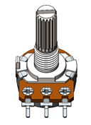
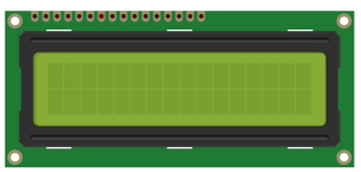

Component Knowledge
===============================================================

LCD1602 
---------------------------------------------------------------

The LCD1602 Display Screen can display 2 lines of characters in 16 columns. It is capable of displaying numbers, letters, symbols, ASCII code and so on. As shown below is a monochrome LCD1602 Display Screen. 

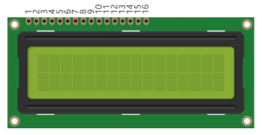

Circuit symbol and pin descriptions of LCD1602 are shown as follows:

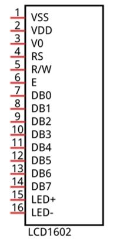

|

.. list-table:: 
    :width: 100%
    :align: center
    :header-rows: 1

    *   -   Pin name
        -   Pin number
        -   Description

    *   -   VSS
        -   1
        -   Negative electrode of power supply

    *   -   VDD
        -   2
        -   Positive electrode of power supply, the voltage is 5V

    *   -   V0
        -   3
        -   Contrast and adjust the display effect

    *   -   RS
        -   4
        -   Data/Command selection

    *   -   RW
        -   5
        -   Read/Write selection

    *   -   E
        -   6
        -   Enable pin

    *   -   D0-D7
        -   7-14
        -   Data pin

    *   -   LED+
        -   15
        -   Positive electrode of backlight LED, the voltage is 5V

    *   -   LED-
        -   16
        -   Negative electrode of backlight LED 

For more details, please refer to the datasheet.

Circuit
===============================================================

The connection of control board and LCD1602 is shown below. And use a rotary potentiometer to adjust the contrast of LCD1602.

.. list-table:: 
    :width: 70%
    :align: center

    *   -   Schematic diagram
    *   -   |Chapter16A_03|
    *   -   Hardware connection
    *   -   |Chapter16A_04|

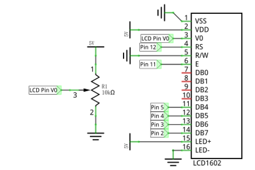
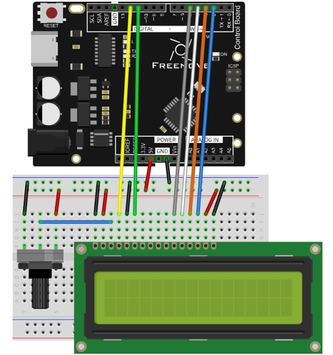

Sketch
===============================================================

Sketch 16.1.1
---------------------------------------------------------------

Now write code to make LCD1602 display a string and changing numbers.

.. literalinclude:: ../../../freenove_17_Kit/Sketches/Sketch_16A_LCD1602/Sketch_16.1.1_Display_the_string_on_LCD1602/Sketch_16.1.1_Display_the_string_on_LCD1602.ino
    :linenos: 
    :language: c

Use LiquidCrystal library to control the LCD:

.. code-block:: c

    #include <LiquidCrystal.h>

LiquidCrystal library provides a specific class used to control LCD1602. We instantiate a LiquidCrystal object, and we can input some parameters which is related to pins of the LCD1602:

.. code-block:: c

    LiquidCrystal lcd(12, 11, 5, 4, 3, 2);

Initialize the LCD1602 in the setup () function, and the parameters are the number of columns and rows of characters which LCD can display:

.. code-block:: c

    lcd.begin(16, 2);

And then print a string:

.. code-block:: c

    lcd.print("hello, world!");

Print a changing number in the loop () function:

.. literalinclude:: ../../../freenove_17_Kit/Sketches/Sketch_16A_LCD1602/Sketch_16.1.1_Display_the_string_on_LCD1602/Sketch_16.1.1_Display_the_string_on_LCD1602.ino
    :linenos: 
    :language: c
    :lines: 21-28

Before printing characters, we need to set the coordinate of the printed character, that is, in which line and which column:

.. code-block:: c

    lcd.setCursor(0, 1);

If we don't set the coordinate, the string will be printed behind the previous printed character.

.. py:function:: LiquidCrystal class

    The LiquidCrystal class can manipulate common LCD screens. The first step is defining an object of LiquidCrystal, for example:
    
        LiquidCrystal lcd(12, 11, 5, 4, 3, 2);
    
    when instantiate the object, we need to write the pins connected to the LCD. There are many different ways for instantiation LiquidCrystal class. The way we use is shown below:
    
        LiquidCrystal(rs, enable, d4, d5, d6, d7) ;

    The common function of LiquidCrystal is shown below:
   
        lcd.begin(cols, rows): Initialize the LCD, and the parameters are the number of columns and rows of characters which LCD can display;
    
        lcd.setCursor(col, row): set the coordinate of the printed character, and the parameters is the row and the column (starting from 0, the number 0 represents first line or column);
    
        lcd.print(data): print the number and letters in the coordinate we set before. If we haven't set the coordinate, the string will be printed behind the last printed character.

Verify and upload the code, then you will see the LCD1602 display the string and changing numbers.

If the display of characters is not normal, shift the rotary potentiometer to adjust the contrast.

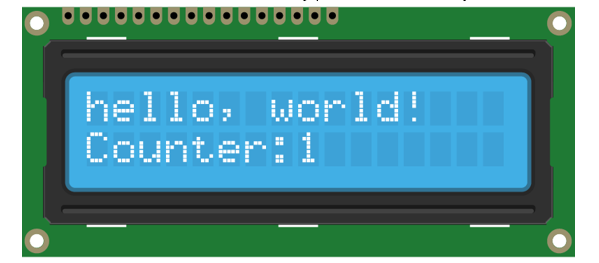

Project LCD1602 Clock
***************************************************************

In the previous chapter, we have used LCD1602 to display some strings, and now let us use LCD1206 to make a clock.

Component List
===============================================================

+-----------------------------------+-------------------------------------------------------------+
| Control board x1                  |  Breadboard x1                                              |
|                                   |                                                             |
|  |Chapter01_00|                   |   |Chapter01_01_0|                                          |
+-----------------------------------+-------------------------------------------------------------+
| USB cable x1                      |  Jumper M/M x2                                              |
|                                   |                                                             |
|  |Chapter01_02|                   |   |Chapter01_06|                                            |
+-----------------------------------+------------------------+-------------------+----------------+
| LCD1602 x1                        | Rotary                 | Thermistor x1     | Resistor       |
|                                   |                        |                   |                |
|                                   | potentiometer x1       |                   | 10kΩ x1        |
|                                   |                        |                   |                |
|  |Chapter16A_00|                  |  |Chapter07_00|        |  |Chapter12_00|   | |Chapter05_00| |
+-----------------------------------+------------------------+-------------------+----------------+

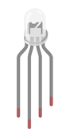
.. |Chapter01_01_0| image:: ../_static/imgs/1_LED_Blink/Chapter01_01.png
    :width: 60%
.. |Chapter01_04| image:: ../_static/imgs/1_LED_Blink/Chapter01_04.png
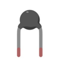

Code Knowledge
===============================================================

Timer
---------------------------------------------------------------

A timer can be set to produce an interrupt after a period of time. When a timer interrupt occurs, the processor will jump to the interrupt function to process the interrupt event. And after completion the processing, execution will return to the interrupted location to go on. If you don't close the timer, interrupt will occur at the intervals you set.

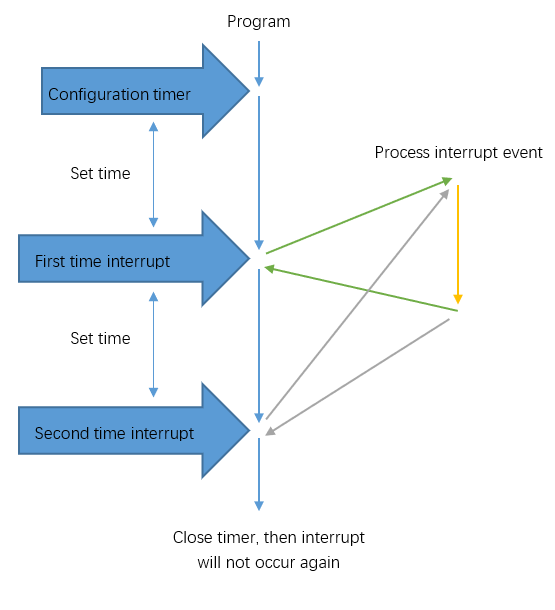

Circuit
===============================================================

The connection between control board and LCD1602 is shown below, and a rotary potentiometer is used to adjust the contrast of LCD1602. Pin A4 port is used to detect the voltage of thermistor.

.. list-table:: 
    :width: 70%
    :align: center

    *   -   Schematic diagram
    *   -   |Chapter16A_07|
    *   -   Hardware connection
    *   -   |Chapter16A_08|

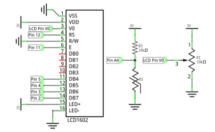
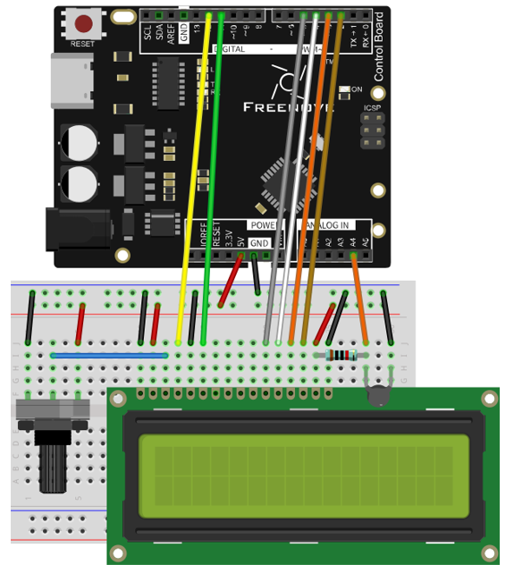

Sketch
===============================================================

Sketch 16.2.1
---------------------------------------------------------------

Before writing code, we need to import the library needed.

Click “Add .ZIP Library...” and then find FlexiTimer2.zip in libraries folder (this folder is in the folder unzipped form the ZIP file we provided). This library can help manipulate the timer.

Now write code to make LCD1602 display the time and temperature, and the time can be modified through the serial port.

.. literalinclude:: ../../../freenove_17_Kit/Sketches/Sketch_16A_LCD1602/Sketch_16.2.1_LCD1602_Clock/Sketch_16.2.1_LCD1602_Clock.ino
    :linenos: 
    :language: c

In the code, we define 3 variables to represent time: second, minute, hour.

.. code-block:: c

    int hour, minute, second;       // define variables to store hour,minute,seconds

Define a timer with cycle of 1000 millisecond (1 second). And each interrupt makes the second plus 1. When setting the timer, you need to define a function and pass the function name that works as parameter to FlexiTimer2::set () function.

.. code-block:: c

    FlexiTimer2::set(1000, timerInt);   // configure timer and timer interrupt function
    FlexiTimer2::start();               // start timer

After every interrupt, the second plus 1.

.. code-block:: c

    void timerInt() {
        sec++;   // second plus 1
    }

.. py:function:: :: operator

    "::" is scope operator.  The function behind "::" belongs to the scope of the front. If we want to call the function defined in the FlexiTimer2 scope outside, we need to use the "::". It can be global scope operator, class scope operator and namespace scope operator. It is a namespace scope operator here. Because functions of FlexiTimer2 library is defined in the namespace of FlexiTimer2, so we can find them in FlexiTimer2 library file.

In the loop () function, the information on the LCD display will be refreshed at set intervals.

.. code-block:: c

    void loop() {
        ...
        lcdDisplay();             // display temperature and time information on LCD
        delay(200);
    }

In the loop function, we need to control the second, minute, hour. When the second increases to 60, the minute adds 1, and the second is reset to zero; when the minute increases to 60, the hour adds 1, and the minute is reset to zero; when the hour increases to 24, reset it to zero.  

.. literalinclude:: ../../../freenove_17_Kit/Sketches/Sketch_16A_LCD1602/Sketch_16.2.1_LCD1602_Clock/Sketch_16.2.1_LCD1602_Clock.ino
    :linenos: 
    :language: c
    :lines: 32-42

We define a function lcdDisplay () to refresh the information on LCD display. In this function, use two bit to display the hour, minute, second on the LCD. For example, hour/ 10 is the unit, hour% 10 is the tens.

.. literalinclude:: ../../../freenove_17_Kit/Sketches/Sketch_16A_LCD1602/Sketch_16.2.1_LCD1602_Clock/Sketch_16.2.1_LCD1602_Clock.ino
    :linenos: 
    :language: c
    :lines: 96-111

Serial port interrupt function is used to receive the data sent by computer to adjust the time, and return the data for confirmation.

.. literalinclude:: ../../../freenove_17_Kit/Sketches/Sketch_16A_LCD1602/Sketch_16.2.1_LCD1602_Clock/Sketch_16.2.1_LCD1602_Clock.ino
    :linenos: 
    :language: c
    :lines: 65-93

We also define a function that displays a scrolling string when the control board has been just started.

.. literalinclude:: ../../../freenove_17_Kit/Sketches/Sketch_16A_LCD1602/Sketch_16.2.1_LCD1602_Clock/Sketch_16.2.1_LCD1602_Clock.ino
    :linenos: 
    :language: c
    :lines: 47-57

Verify and upload the code. The LCD screen will display a scrolling string first, and then displays the temperature and time. We can open Serial Monitor and enter time in the sending area, then click the Send button to set the time.

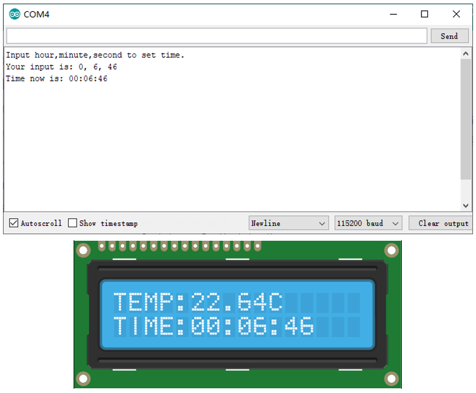