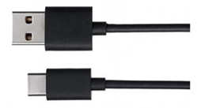

##############################################################################
Chapter Stepper Motor
##############################################################################

A Stepper motor is a kind of motor that can rotate a certain angle at a time, with which we can achieve mechanical movement at a higher accuracy more easily.

Project Drive Stepper Motor
***************************************************************

Now, try to drive a stepper motor.

Component List
===============================================================

+-----------------------------------+---------------------------------------+
| Control board x1                  |  Breadboard x1                        |
|                                   |                                       |
|  |Chapter01_00|                   |   |Chapter18_00|                      |
+-----------------------------------+---------------------------------------+
| USB cable x1                      | I2C LCD1602 Module x1                 |
|                                   |                                       |
|  |Chapter01_02|                   |  |Chapter18_01|                       |
+-----------------------------------+                                       |
| Jumper M/M x3                     |                                       |
|                                   |                                       |
|  |Chapter01_06|                   |                                       |
+-----------------------------------+---------------------------------------+

.. |Chapter01_00| image:: ../_static/imgs/1_LED_Blink/Chapter01_00.png

.. |Chapter01_04| image:: ../_static/imgs/1_LED_Blink/Chapter01_04.png
.. |Chapter01_06| image:: ../_static/imgs/1_LED_Blink/Chapter01_06.png

Component Knowledge
===============================================================

Stepper Motor
---------------------------------------------------------------

Stepper Motors are an open-loop control device, which converts an electronic pulse signal into angular displacement or linear displacement. In a non-overload condition, the speed of the motor and the location of the stops depends only on the pulse signal frequency and number of pulses and is not affected by changes in load as with a DC Motor. A small Four-Phase Deceleration Stepper Motor is shown here:

The electronic schematic diagram of a Four-Phase Stepper Motor is shown below:

The outside case or housing of the Stepper Motor is the Stator and inside the Stator is the Rotor. There are a specific number of individual coils, usually an integer multiple of the number of phases the motor has, when the Stator is powered ON, an electromagnetic field will be formed to attract a corresponding convex diagonal groove or indentation in the Rotor’s surface. The Rotor is usually made of iron or a permanent magnet. Therefore, the Stepper Motor can be driven by powering the coils on the Stator in an ordered sequence (producing a series of “steps” or stepped movements).

A common drive sequence is as follows:

In the sequence above, the Stepper Motor rotates once at a certain angle, which is called a “step”. By controlling the number of rotational steps, you can then control the Stepper Motor’s rotation angle. By defining the time between two steps, you can control the Stepper Motor’s rotation speed.  

There are other methods to control Stepper Motors, such as: connect A phase, then connect A B phase, the stator will be located in the center of A B, which is called a half-step. We can use this way to improve the stepper motor’s stability and reduce noise at the same time. If you are interested in it, you can learn this method yourself by searching related knowledge.

The stator in the Stepper Motor we have supplied has 32 magnetic poles. Therefore, to complete one full revolution requires 32 full steps. The rotor (or output shaft) of the Stepper Motor is connected to a speed reduction set of gears and the reduction ratio is 1:64. Therefore, the final output shaft (exiting the Stepper Motor’s housing) requires 32 X 64 = 2048 steps to make one full revolution.

ULN2003 stepper motor driver
---------------------------------------------------------------

A ULN2003 Stepper Motor Driver is used to convert weak signals into more powerful control signals in order to drive the Stepper Motor. In the illustration below, the input signal IN1-IN4 corresponds to the output signal A-D, and 4 LEDs are integrated into the board to indicate the state of these signals. The PWR interface can be used as a power supply for the Stepper Motor. By default, PWR and VCC are connected.

Circuit

Use pin 11, 10, 9, 8 on the control board to control the ULN2003 stepper motor driver, and connect it to the stepper motor.

.. list-table:: 
    :width: 70%
    :align: center

    *   -   Schematic diagram
    *   -   |Chapter18_06|
    *   -   Hardware connection
    *   -   |Chapter18_07|

Sketch
===============================================================

Sketch 18.1.1
---------------------------------------------------------------

Now write code to control the stepper motor through ULN2003 stepper motor driver.

.. literalinclude:: ../../../freenove_17_Kit/Sketches/Sketch_18.1.1_Drive_Stepper_Motor/Sketch_18.1.1_Drive_Stepper_Motor.ino
    :linenos: 
    :language: c

In the code, we define a function to make the motor rotate for a step. And the parameter determines the rotation direction of the stepper motor.

.. code-block:: c

    void moveOneStep(bool dir) {
    ...
    }

A variable is defined in this function and we use four low bits to show the state of 4 ports. These ports are connected in order, so the variable can be assigned to 0x01 and we can use the shifting method to change the bit of the connected port.

.. literalinclude:: ../../../freenove_17_Kit/Sketches/Sketch_18.1.1_Drive_Stepper_Motor/Sketch_18.1.1_Drive_Stepper_Motor.ino
    :linenos: 
    :language: c
    :lines: 37-45

Then change the state of the port according to the above variables.

.. code-block:: c

    // Output signal to each port
    for (int i = 0; i < 4; i++) {
        digitalWrite(outPorts[i], (out & (0x01 << i)) ? HIGH : LOW);
    }

We define a function to control the step motor to rotate several steps and control the direction and speed through parameters. Call it directly in the loop () function.

.. literalinclude:: ../../../freenove_17_Kit/Sketches/Sketch_18.1.1_Drive_Stepper_Motor/Sketch_18.1.1_Drive_Stepper_Motor.ino
    :linenos: 
    :language: c
    :lines: 36-50

Verify and upload the code, and you will see the step motor rotate a full turn, and then repeat this process in a reverse direction.

