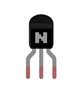

##############################################################################
Chapter Matrix Keypad
##############################################################################

We've already learned and used a push button switch before, now let us try to use a keypad, a device integrated with a number of Push Button Switches as Keys for the purposes of Input.

Project Get Input Characters
***************************************************************

First, try to understand the keypad, and get the input characters.

Component List
===============================================================

+-----------------------------------+---------------------------------------+
| Control board x1                  |                                       |
|                                   |  4x4 keypad x1                        |
|  |Chapter01_00|                   |                                       |
+-----------------------------------+    |Chapter19_00|                     |
| USB cable x1                      |                                       |
|                                   |                                       |
|  |Chapter01_02|                   |                                       |
+-----------------------------------+                                       |
| Jumper M/M x3                     |                                       |
|                                   |                                       |
|  |Chapter01_06|                   |                                       |
+-----------------------------------+---------------------------------------+

.. |Chapter01_00| image:: ../_static/imgs/1_LED_Blink/Chapter01_00.png
    :width: 70%
.. |Chapter01_06| image:: ../_static/imgs/1_LED_Blink/Chapter01_06.png

.. |Chapter01_02| image:: ../_static/imgs/1_LED_Blink/Chapter01_02.png

Component Knowledge
===============================================================

4x4 keypad
---------------------------------------------------------------

A Keypad Matrix is a device that integrates a number of keys in one package. As is shown below, a 4x4 Keypad Matrix integrates 16 keys (think of this as 16 Push Button Switches in one module):

Similar to the integration of an LED Matrix, the 4x4 Keypad Matrix has each row of keys connected with one pin and this is the same for the columns. Such efficient connections reduce the number of processor ports required. The internal circuit of the Keypad Matrix is shown below.

The method of usage is similar to the Matrix LED, by using a row or column scanning method to detect the state of each key’s position by column and row. Take column scanning method as an example, send low level to the first 1 column (Pin1), detect level state of row 5, 6, 7, 8 to judge whether the key A, B, C, D are pressed. Then send low level to column 2, 3, 4 in turn to detect whether other keys are pressed. Therefore, you can get the state of all of the keys.

Circuit
===============================================================

Use pin 11-4 on control board to connect 4x4 keypad.

.. list-table:: 
    :width: 100%
    :align: center

    *   -   Schematic diagram
        -   Hardware connection
    *   -   |Chapter19_03|
        -   |Chapter19_04|

Sketch
===============================================================

Sketch 19.1.1
---------------------------------------------------------------

Before writing code, we need to import the library needed.

Click “Add .ZIP Library...” and then find Keypad.zip in libraries folder (this folder is in the folder unzipped form the ZIP file we provided). This library can facilitate our operation of keypad.

Now write the code to obtain the keypad characters, and send them to the serial port.

.. literalinclude:: ../../../freenove_17_Kit/Sketches/Sketch_19.1.1_Get_Input_Characters/Sketch_19.1.1_Get_Input_Characters.ino
    :linenos: 
    :language: c

In the code, we use a Keypad class provided by the Keypad library to operate the keypad. The following code is to instantiate a keypad object, and the last two parameters represent the number of the row and column of the keypad.

.. code-block:: c

    Keypad myKeypad = Keypad(makeKeymap(keys), rowPins, colPins, 4, 4);

The two-dimensional arrays record the keypad characters, and these characters can be returned when you press the keyboard.

.. literalinclude:: ../../../freenove_17_Kit/Sketches/Sketch_19.1.1_Get_Input_Characters/Sketch_19.1.1_Get_Input_Characters.ino
    :linenos: 
    :language: c
    :lines: 12-17

These two arrays record the row and column's connection pins of keypad.

    byte rowPins[4] = {11, 10, 9, 8}; // connect to the row pinouts of the keypad
    byte colPins[4] = {7, 6, 5, 4};   // connect to the column pinouts of the keypad

Send the input that get from the keyboard to the computer via the serial port in function loop().

.. literalinclude:: ../../../freenove_17_Kit/Sketches/Sketch_19.1.1_Get_Input_Characters/Sketch_19.1.1_Get_Input_Characters.ino
    :linenos: 
    :language: c
    :lines: 30-37

Verify and upload the code, open the Serial Monitor and press the keypad, and then you will see the characters you press being printed out.

Project Combination Lock
***************************************************************

Now, let us try to use keypad to make a combination lock.

Component List
===============================================================

+------------------------------------+---------------------------------+
| Control board x1                   | 4x4 keypad x1                   |
|                                    |                                 |
|  |Chapter01_00|                    |  |Chapter19_00|                 |
+------------------------------------+---------------------------------+
| USB cable x1                       | NPN transistor x1               |
|                                    |                                 |
|  |Chapter01_02|                    |  |Chapter09_00|                 |
+------------------------------------+---------------------------------+
| Resistor 1kΩ x1                    | Active buzzer x1                |
|                                    |                                 |
|  |Chapter09_02|                    |  |Chapter09_01|                 |
+------------------------------------+---------------------------------+
| Jumper M/M x15                     | Servo x1                        |
|                                    |                                 |
|  |Chapter01_06|                    |  |Chapter11_00|                 |
+------------------------------------+---------------------------------+

Circuit
===============================================================

Use pin 11-4 on the control board to connect 4x4 keypad, pin 13 to drive buzzer and pin 12 to drive servo. Servos can be used to drive the mechanical switch and turn on the switch when the password is correct.

.. list-table:: 
    :width: 100%
    :align: center

    *   -   Schematic diagram
        -   Hardware connection
    *   -   |Chapter19_06|
        -   |Chapter19_07|

.. |Chapter19_07| image:: ../_static/imgs/19_Matrix_Keypad/Chapter19_07.png

Sketch
===============================================================

Sketch 19.2.1
---------------------------------------------------------------

Now write the code to obtain the keypad characters, and compare them with the preset password. If the input is correct, the servo moves, otherwise the buzzer makes an input error alarm.

.. literalinclude:: ../../../freenove_17_Kit/Sketches/Sketch_19.2.1_Combination_Lock/Sketch_19.2.1_Combination_Lock.ino
    :linenos: 
    :language: c

Based on the last section, this code adds a comparison function, the corresponding action will be different whenever the password is right or wrong.

First we define a correct password with four characters.

.. code-block:: c

    char passWord[] = {'1', '2', '3', '4'}; // save the right password

Make a prompt sound every time when a key is pressed and save the pressed characters.

.. code-block:: c

    if (keyPressed) {
        // Make a prompt tone each time press the key.
        digitalWrite(buzzerPin, HIGH);
        delay(100);
        digitalWrite(buzzerPin, LOW);
        // Save the input characters
        keyIn[keyInNum++] = keyPressed;
        ...
    }

Compare with the preset password after 4 characters are input and adopt the corresponding operation.

.. literalinclude:: ../../../freenove_17_Kit/Sketches/Sketch_19.2.1_Combination_Lock/Sketch_19.2.1_Combination_Lock.ino
    :linenos: 
    :language: c
    :lines: 51-68

Verify and upload the code, and press the keypad to input password with 4 characters. If the input is correct, the servo will move to a certain degree, and then return to the original position. If the input is error, an input error alarm will be generated.

