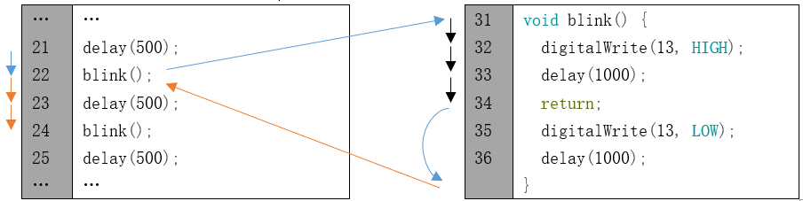

##############################################################################
Chapter LED Blink Smoothly
##############################################################################

In the previous chapter, we have used Sketch to control up to 10 LEDs on the control board to blink and learned some basic knowledge of programming. Now, let us try to make LED emit different brightness of light.

Project LEDs Emit Different Brightness
***************************************************************

Now, let us use control board to make 4 LED emit different brightness of light.

Component List
===============================================================

+-----------------------------------+---------------------------------------+
| Control board x1                  |  Breadboard x1                        |
|                                   |                                       |
|  |Chapter01_00|                   |   |Chapter01_01|                      |
+-----------------------------------+-------------------+-------------------+
| USB cable x1                      | LED x4            | Resistor 220Ω x4  |
|                                   |                   |                   |
|  |Chapter01_02|                   |  |Chapter01_03|   |  |Chapter01_04|   |
+-----------------------------------+                   |                   |
| Jumper M/M x5                     |                   |                   |
|                                   |                   |                   |
|  |Chapter01_06|                   |                   |                   |
+-----------------------------------+-------------------+-------------------+

.. |Chapter01_00| image:: ../_static/imgs/1_LED_Blink/Chapter01_00.png
.. |Chapter01_01| image:: ../_static/imgs/1_LED_Blink/Chapter01_01.png
    :width: 85%
.. |Chapter01_02| image:: ../_static/imgs/1_LED_Blink/Chapter01_02.png

.. |Chapter01_04| image:: ../_static/imgs/1_LED_Blink/Chapter01_04.png
.. |Chapter01_06| image:: ../_static/imgs/1_LED_Blink/Chapter01_06.png

Circuit Knowledge
===============================================================

At first, let us learn how to use the circuit to make LED emit different brightness of light,

PWM
---------------------------------------------------------------

PWM, Pulse-Width Modulation, is a very effective method for using digital signals to control analog circuits. Digital processors cannot directly output analog signals. PWM technology makes it very convenient to achieve this conversion (translation of digital to analog signals).

PWM technology uses digital pins to send certain frequencies of square waves, that is, the output of high levels and low levels, which alternately last for a while. The total time for each set of high levels and low levels is generally fixed, which is called the period (Note: the reciprocal of the period is frequency). The time of high level outputs are generally called “pulse width”, and the duty cycle is the percentage of the ratio of pulse duration, or pulse width (PW) to the total period (T) of the waveform. 

The longer the output of high levels last, the longer the duty cycle and the higher the corresponding voltage in the analog signal will be. The following figures show how the analog signal voltages vary between 0V-5V (high level is 5V) corresponding to the pulse width 0%-100%:

The longer the PWM duty cycle is, the higher the output power will be. Now that we understand this relationship, we can use PWM to control the brightness of an LED or the speed of DC motor and so on.

Code Knowledge
===============================================================

We will use new code knowledge in this section.

Return value of function
---------------------------------------------------------------

We have learned and used the function without return value, now we will learn how to use the function with return value. A function with return value is shown as follow:

.. code-block:: c

    int sum(int i, int j) {
        int k = i + j;
        return k;
    }

"int" declares the type of return value of the function sum(int i, int j). If the type of the return value is void, the function does not return a value.

One function can only return one value. It is necessary to use the return statement to return the value of function.

When the return statement is executed, the function will return immediately regardless of code behind the return statement in this function.

A function with return value is called as follows:

.. code-block:: c

    int a = 1, b = 2, c = 0;
    c = sum(1, 2);            // after the execution the value of c is 3

A function with a return value can also be used as a parameter of functions, for example:

.. code-block:: c

    delay(sum(100, 200));

It is equivalent to the following code:

.. code-block:: c

    delay(300);

return
---------------------------------------------------------------

We have learned the role of the return statement in a function with a return value. It can also be used in functions without a return value, and there is no data behind the return keyword:

.. code-block:: c

    return;

In this case, when the return statement is executed, the function will immediately end its execution rather than return to the end of the function. For example:

Circuit
===============================================================

Use pin 5, 6, 9, 10 on the control board to drive 4 LEDs.

.. list-table:: 
    :width: 100%
    :align: center

    *   -   Schematic diagram
        -   Hardware connectionS

    *   -   |Chapter04_02|
        -   |Chapter04_03|

Sketch
===============================================================

Sketch 4.1.1
---------------------------------------------------------------

Now let us use sketch to make 4 LEDs emit different brightness of light. We will transmit signal to make the 4 ports connected to LEDs output the PWM waves with duty cycle of 2%, 10%, 50%, and 100% to let the LEDs emit different brightness of the light.

.. literalinclude:: ../../../freenove_17_Kit/Sketches/Sketch_4.1.1_LEDs_Emit_Different_Brightness/Sketch_4.1.1_LEDs_Emit_Different_Brightness.ino
    :linenos: 
    :language: c

After the initialization of the 4 ports, we set the ports to output PWM waves with different duty cycle. Take ledPin1 as an example, firstly map 2% to the range of 0-255, and then output the PWM wave with duty cycle of 2%, 

.. code-block:: c

    analogWrite(ledPin1, map(2, 0, 100, 0, 255));

.. list-table:: 
    :width: 100%
    :align: center

    *   -   :orange:`analogWrite(pin, value)`
    
    *   -   Arduino IDE provides the function, analogWrite(pin, value), which can make ports directly output PWM

            waves. Only the digital pin marked with "~" symbol on the control board can use this function to output
            
            PWM waves. In the function called analogWrite(pin, value), the parameter "pin" specifies the port used
    
            to output PWM wave. The range of value is 0-255, which represents the duty cycle of 0%-100%.
            
            In order to use this function, we need to set the port to output mode.

.. list-table:: 
    :width: 100%
    :align: center

    *   -   :orange:`map(value, fromLow, fromHigh, toLow, toHigh)`
    
    *   -   This function is used to remap a value, which will return a new value whose percentage in the range of
    
            toLow-toHigh is equal to the percentage of "value" in the range of fromLow-fromHigh. For example, 1 is
            
            the maximum in the range of 0-1 and the maximum value in the scope of 0-2 is 2, that is, the result value
            
            of map (1, 0, 1, 0, 2) is 2.

Verify and upload the code, and you will see the 4 LEDs emit light with different brightness.

.. image:: ../_static/imgs/4_LED_Blink_Smoothly/Chapter04_04.png
    :align: center

Project LED Blinking Smoothly
***************************************************************

We will learn how to make a LED blink smoothly, that is, breathing light.

Component List
===============================================================

The Component list is basically the same as those in last section. And we need to get rid of a few LEDs and resistors.

Circuit
===============================================================

Remove some LEDs and resistors connected to pin 6, 9, 10 on the control board in the circuit of the previous section. 

.. list-table:: 
    :width: 100%
    :align: center

    *   -   Schematic diagram
        -   Hardware connectionS

    *   -   |Chapter04_05|
        -   |Chapter04_06|

Sketch
===============================================================

Sketch 4.2.1
---------------------------------------------------------------

Now complete the sketch to make brightness of LED change from dark to bright, and then from bright to dark. That is to make the duty cycle of the PWM wave change from 0%-100%, and then from 100%-0% cyclically.

.. literalinclude:: ../../../freenove_17_Kit/Sketches/Sketch_4.2.1_LED_Blink_Smoothly/Sketch_4.2.1_LED_Blink_Smoothly.ino
    :linenos: 
    :language: c

Through two “for” loops, the duty cycle of the PWM wave changes from 0% to 100%, and then from 100% to 0% cyclically. delay(ms) function is used to control the change rate in the "for" loop, and you can try to modify the parameters to modify the change rate of brightness.

Verify and upload the code, then you will see that the brightness of the LED changes from dark to light, and from the light to dark cyclically.

