##############################################################################
Chapter Serial
##############################################################################

Earlier, we have already tried to output signals to LED, and get the input signal of push button switch. Now, we can try serial communication, a more advanced means of communication.

Project Send Data through Serial
***************************************************************

We will use the serial port on control board to send data to computer.

Component List
===============================================================

.. list-table:: 
    :width: 100%
    :align: center

    *   -   Control board x1
        -   USB cable x1

    *   -   |Chapter01_00|
        -   |Chapter01_02|

.. |Chapter01_00| image:: ../_static/imgs/1_LED_Blink/Chapter01_00.png
    :width: 70%
.. |Chapter01_02| image:: ../_static/imgs/1_LED_Blink/Chapter01_02.png

Code Knowledge
===============================================================

Bit and Byte
---------------------------------------------------------------

As mentioned earlier, computers use a binary signal. A binary signal is called 1 bit, and 8 bits organized in order is called 1 byte. Byte is the basic unit of information in computer storage and processing. 1 byte can represent 2^8=256 numbers, that is, 0-255. For example:

As to binary number 10010110, "0" usually presents the lowest value in code.

.. list-table:: 
    :width: 60%
    :align: center

    *   -   Sequence
        -   7
        -   6
        -   5
        -   4
        -   3
        -   2
        -   1
        -   0

    *   -   Number
        -   1
        -   0
        -   0
        -   1
        -   0
        -   1
        -   1
        -   0

When a binary number need to be converted to decimal number, first, the nth number of it need be multiplied by n power of 2, then sum all multiplicative results. Take 10010110 as an example:

.. container:: centered

    1*2^7+0*2^6+0*2^5+1*2^4+0*2^3+1*2^2+1*2^1+0*2^0=150

We can make a decimal number divided by 2 to convert it to binary number. Get the integer quotient for the next iteration and get the remainder for the binary digit. Repeat the steps until the quotient is equal to zero. Arrange all remainders from right to left in a line. Then we complete the conversion. For example:

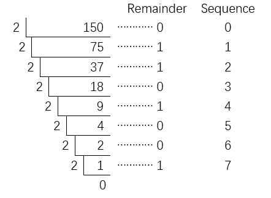

The result is 10010110.

Circuit Knowledge
===============================================================

Serial and parallel communication
---------------------------------------------------------------

Serial communication uses one data cable to transfer data one bit by another in turn, while parallel communication means that the data is transmitted simultaneously on multiple cables. Serial communication takes only a few cables to exchange information between systems, which is especially suitable for computers to computer, long distance communication between computers and peripherals. Parallel communication is faster, but it requires more cables and higher cost, so it is not appropriate for long distance communication.

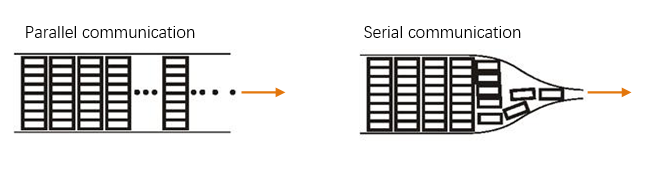

Serial communication
---------------------------------------------------------------

Serial communication generally refers to the Universal Asynchronous Receiver/Transmitter (UART), which is commonly used in electronic circuit communication. It has two communication lines, one is responsible for sending data (TX line) and the other for receiving data (RX line). The serial communication connections of two devices use is as follows:

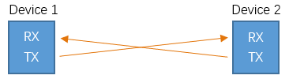

Before serial communication starts, the baud rate in both sides must be the same. Only use the same baud rate can the communication between devices be normal. The baud rates commonly used are 9600 and 115200.

Serial port on Control board
---------------------------------------------------------------

Control board has integrated USB to serial transfer, so it can communicate with computer when USB cable get connected to it. Arduino IDE also uploads code to control board through the serial connection.

Computer identifies serial devices connected to your computer as COMx. We can use the Serial Monitor window of Arduino IDE to communicate with control board, connect control board to computer through the USB cable, choose the correct device, and then click the Serial Monitor icon to open the Serial Monitor window.

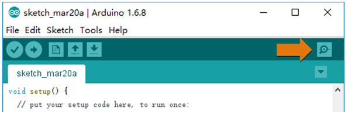

Interface of Serial Monitor window is as follows. If you can't open it, make sure control board had been connected to the computer, and choose the correct serial port in the menu bar "Tools".

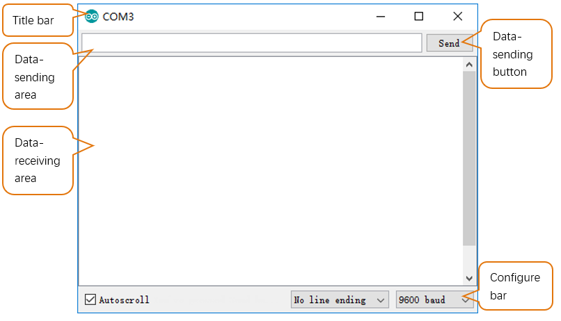

Circuit
===============================================================

Connect control board to the computer with USB cable.

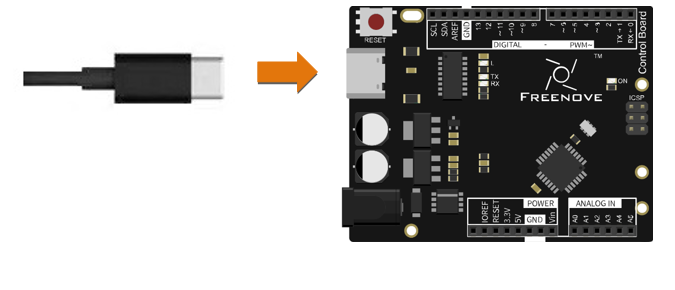

Sketch
===============================================================

Sketch 6.1.1
---------------------------------------------------------------

Now, write code to send some texts to the Serial Monitor window

.. literalinclude:: ../../../freenove_17_Kit/Sketches/Sketch_6.1.1_Send_data_through_Serial/Sketch_6.1.1_Send_data_through_Serial.ino
    :linenos: 
    :language: c

setup() function initializes the serial port.

And then continuously sends variable counter values in the loop () function.

.. list-table:: 
    :width: 50%
    :align: center

    *   -   :orange:`Serial class`
    *   -   Class is a C++ language concept. Arduino IDE supports C++ language, which is a language extension. We 
       
            don't explain specifically the concept here, but only describe how to use it. If you are interested in
            
            it, you can learn by yourself. Serial is a class name, which contains variables and functions. You can

            use the "." operational character to visit class variables and functions, such as:

            **Serial.begin(speed):** Initialize serial port, the parameter is the serial port baud rate;
    
            **Serial.print(val):** Send string, the parameter here is what you want to send;

            **Serial.println(val):** Send newline behind string.

Verify and upload the code, open the Serial Monitor, and then you'll see data sent from control board.

If it is not displayed correctly, check whether the configuration of the Serial Monitor in the lower right corner of the window is correct. 

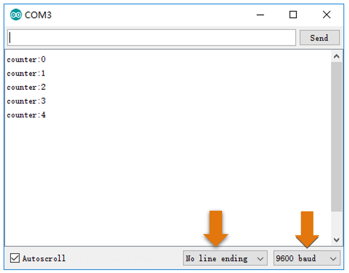

Project Receive Data through Serial Port
***************************************************************

In the previous section, we used Serial port on control board to send data to a computer, now we will use it to receive data from computer.

Component List
===============================================================

Same with the previous section.

Code Knowledge
===============================================================

Interrupt
---------------------------------------------------------------

An interrupt is a controller's response to an event. The event causing an interrupt is an interrupt source. We'll illustrate the interruption concept. For example, suppose you're watching TV while there is water in your kitchen heating, then you have to check whether the water is boiling or not from time to time, so you can't concentrate on watching TV. But if you have an interrupt, things will be different. Interrupt can work as a warning device for your kettle, which will beep when the water is about to boil.  So before the water is boiling, you can focus on watching TV until a beep warning comes out.

Advantages of interrupt here: Processor won't need to check whether the event has happened every now and then, but when an event occurs, it informs the controller immediately. When an interrupt occurs, the processor will jump to the interrupt function to handle interrupt events, then return to where the interrupt occurs after finishing it and go on this program.

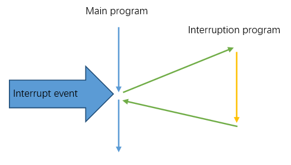

Circuit
===============================================================

Same with the previous section.

Sketch
===============================================================

Sketch 6.2.1
---------------------------------------------------------------

Now, write code to receive the characters from Serial Monitor window, and send it back.

.. literalinclude:: ../../../freenove_17_Kit/Sketches/Sketch_6.2.1_Receive_Data_through_Serial_Port/Sketch_6.2.1_Receive_Data_through_Serial_Port.ino
    :linenos: 
    :language: c

In the setup() function, we initialize the serial port. Then, the loop() function will continuously detect whether there are data  to read. if so, it will read the character and send it back.

.. list-table:: 
    :width: 20%
    :align: center

    *   -   :orange:`Serial Class`
    *   -   Serial.available(): return bytes of data that need to be read by serial port;

            Serial.read(): return 1 byte of data that need to be read  by serial port.

Verify and upload the code, open the Serial Monitor, write character in the sending area, click Send button, then you'll see information returned from control board.

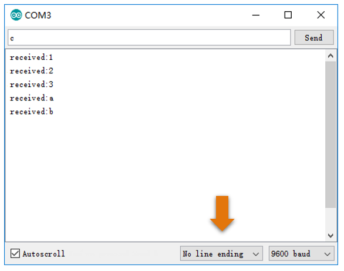

        
.. py:function:: char type

    char type variable can represent a character, but it cannot store characters directly. It stores numbers to replace characters. char type occupies 1-byte store area, and use a value 0-127 to correspond to 128 characters. The corresponding relation between number and character is ruled by ASCII table. For more details of ASCII table, please refer to the appendix of this book.
    
    Example: Define char aChar = 'a', bChar = '0', then the decimal value of aChar is 97, bChar will be 48.

Sketch 6.2.2
---------------------------------------------------------------

When serial port receives data, it can trigger an interrupt event, and enters into the interrupt handling function. Now we use an interrupt to receive information from Serial Monitor window, and send it back. To illustrate that the interrupt does not influence the program's running, we will constantly send changing number in loop () function.

.. literalinclude:: ../../../freenove_17_Kit/Sketches/Sketch_6.2.2_Receive_Data_through_Serial_Port/Sketch_6.2.2_Receive_Data_through_Serial_Port.ino
    :linenos: 
    :language: c

void serialEvent () function here is the serial port interrupt function. When serial receives data, processor will jump to this function, and return to where the interrupt occurs to proceed after execution. So loop () function's running is not affected.

Verify and upload the code, open the Serial Monitor, then you'll see the number constantly sent from control board. Fill in characters in the sending area, and click the Send button, then you'll see the string returned from control board.

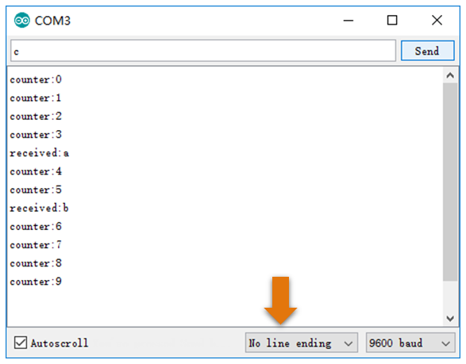

Project Application of Serial
***************************************************************

We will use the serial port on control board to control one LED.

Component List
===============================================================

+-----------------------------------+---------------------------------------+
| Control board x1                  |  Breadboard x1                        |
|                                   |                                       |
|  |Chapter01_00_1|                 |   |Chapter01_01|                      |
+-----------------------------------+-------------------+-------------------+
| USB cable x1                      | LED x1            | Resistor 220Ω x1  |
|                                   |                   |                   |
|  |Chapter01_02|                   |  |Chapter01_03|   |  |Chapter01_04|   |
+-----------------------------------+                   |                   |
| Jumper M/M x2                     |                   |                   |
|                                   |                   |                   |
|  |Chapter01_06|                   |                   |                   |
+-----------------------------------+-------------------+-------------------+

.. |Chapter01_00_1| image:: ../_static/imgs/1_LED_Blink/Chapter01_00.png
.. |Chapter01_01| image:: ../_static/imgs/1_LED_Blink/Chapter01_01.png
    :width: 85%
.. |Chapter01_03| image:: ../_static/imgs/1_LED_Blink/Chapter01_03.png
.. |Chapter01_04| image:: ../_static/imgs/1_LED_Blink/Chapter01_04.png
.. |Chapter01_06| image:: ../_static/imgs/1_LED_Blink/Chapter01_06.png

Circuit
===============================================================

Here we will use pin 11 of the control board to output PWM to drive 1 LED.

.. list-table:: 
    :width: 100%
    :align: center

    *   -   Schematic diagram
        -   Hardware connection

    *   -   |Chapter06_10|
        -   |Chapter06_11|

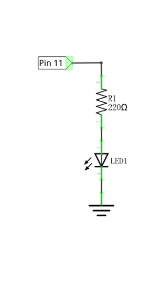
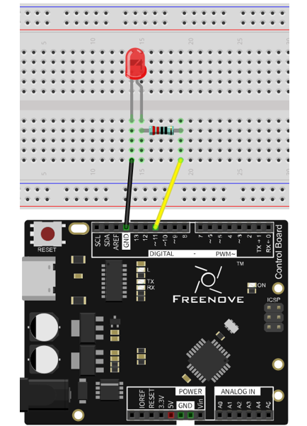

Sketch
===============================================================

Sketch 6.3.1
---------------------------------------------------------------

Code is basically the same with Sketch 6.2.1. But after receiving the data, control board will convert it into PWM duty cycle of output port.

.. literalinclude:: ../../../freenove_17_Kit/Sketches/Sketch_6.3.1_Application_of_Serial/Sketch_6.3.1_Application_of_Serial.ino
    :linenos: 
    :language: c

When serial receives data, it converts the data into PWM duty cycle of output port to make  LED emit light with corresponding brightness.

.. py:function:: Serial Class

    Serial.parseInt(): Receive an int type number as the return value.

.. py:function:: constrain(x, a, b)

    Limit x between a and b, if x<a, return a; if x>b, return b.

Verify and upload the code, open the Serial Monitor, and put a number in the range of 0-255 into the sending area and click the Send button. Then you'll see information returned from control board, meanwhile, LED can emit light with different brightness according to the number you send.

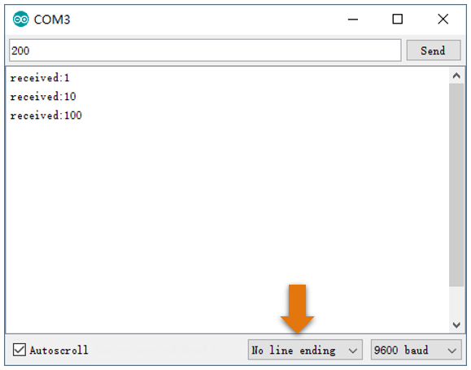