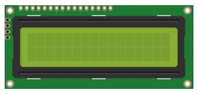
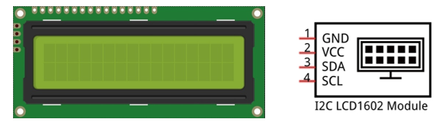
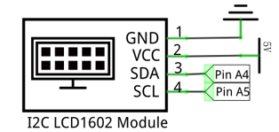
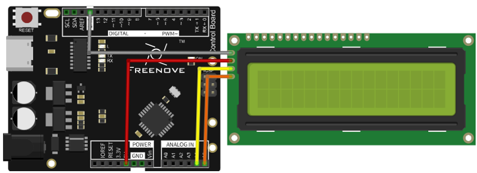
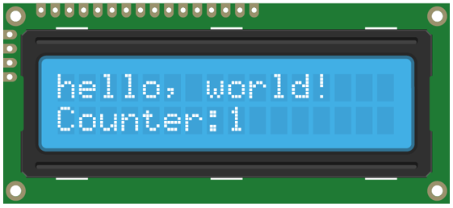
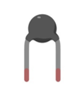
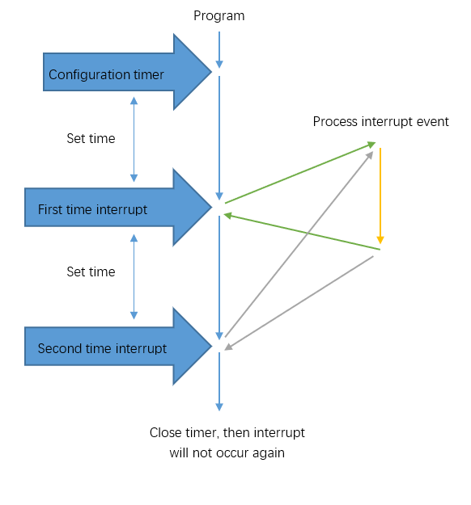
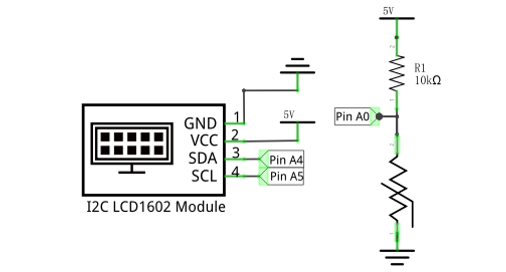
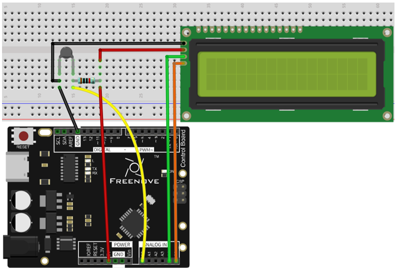
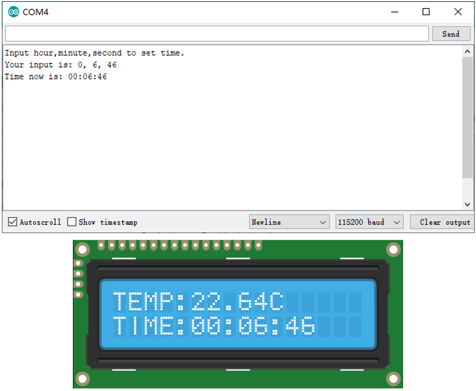

##############################################################################
Chapter B LCD1602
##############################################################################

.. note::
    
    Please select the appropriate chapter according to your LCD model.

This chapter only applies to I2C LCD1602. Please select another chapter for LCD1602.

Project Display the String on I2C LCD1602
***************************************************************

Firstly, use I2C LCD1602 to display some strings.

+-----------------------------------+---------------------------------------+
| Control board x1                  |  Breadboard x1                        |
|                                   |                                       |
|  |Chapter01_00_1|                 |   |Chapter01_01|                      |
+-----------------------------------+---------------------------------------+
| USB cable x1                      | I2C LCD1602 Module x1                 |
|                                   |                                       |
|  |Chapter01_02|                   |  |Chapter16B_00|                      |
+-----------------------------------+                                       |
| Jumper M/M x3                     |                                       |
|                                   |                                       |
|  |Chapter01_06|                   |                                       |
+-----------------------------------+---------------------------------------+

.. |Chapter01_00_1| image:: ../_static/imgs/1_LED_Blink/Chapter01_00.png
.. |Chapter01_01| image:: ../_static/imgs/1_LED_Blink/Chapter01_01.png
    :width: 93%
.. |Chapter01_04| image:: ../_static/imgs/1_LED_Blink/Chapter01_04.png
.. |Chapter01_06| image:: ../_static/imgs/1_LED_Blink/Chapter01_06.png

.. |Chapter01_02| image:: ../_static/imgs/1_LED_Blink/Chapter01_02.png

Component Knowledge
===============================================================

I2C LCD1602
---------------------------------------------------------------

LCD1602 can display 2 lines of characters in 16 columns. It can display numbers, letters, symbols, ASCII code and so on.

I2C LCD1602 Display Screen integrates a I2C interface, which connects the serial-input & parallel-output module to the LCD1602 Display Screen. This allows us to only use 4 lines to the operate the LCD1602.

I2C (Inter-Integrated Circuit) is a two-wire serial communication, which is used to connect micro controller with its peripheral equipments. Device that use I2C communication are all connected to the serial data (SDA) line and a serial clock (SCL) line (called I2C bus). Each device among them has a unique address and can be a transmitter or receiver. Additionally, they can communicate with devices connected to the Bus.

Next, lets try to use the LCD1602 I2C module to display characters.

Circuit
===============================================================

The connection of control board and I2C LCD1602 is shown below.

.. list-table:: 
    :width: 70%
    :align: center

    *   -   Schematic diagram
    *   -   |Chapter16B_02|
    *   -   Hardware connection
    *   -   |Chapter16B_03|

Sketch
===============================================================

Sketch 16.1.1
---------------------------------------------------------------

Before writing code, we need to import the library needed.

Click “Add .ZIP Library...” and then find LiquidCrystal_I2C.zip in libraries folder (this folder is in the folder unzipped form the ZIP file we provided). This library can facilitate our operation of I2C LCD1602.

Now let's start to write code to use LCD1602 to display static characters and dynamic variables.

.. literalinclude:: ../../../freenove_17_Kit/Sketches/Sketch_16B_I2C_LCD1602/Sketch_16.1.1_Display_the_string_on_LCD1602/Sketch_16.1.1_Display_the_string_on_LCD1602.ino
    :linenos: 
    :language: c

Following are the LiquidCrystal_I2C library used for controlling LCD:

.. code-block:: c

    #include <LiquidCrystal_I2C.h>

LiquidCrystal_I2C library provides LiquidCrystal_I2C class that controls LCD1602. When we instantiate a LiquidCrystal_I2C object, we can input some parameters. And these parameters are the row/column numbers of the I2C addresses and screen that connect to LCD1602:

.. code-block:: c

    LiquidCrystal_I2C lcd(0x27, 16, 2); // set the LCD address to 0x27 for a 16 chars and 2 line display

First, initialize the LCD and turn on LCD backlight.

.. code-block:: c

    lcd.init();                      // initialize the lcd
    lcd.backlight();                   // Turn on backlight

And then print a string:

.. code-block:: c

    lcd.print("hello, world!");        // Print a message to the LCD

Print a changing number in the loop () function:

.. literalinclude:: ../../../freenove_17_Kit/Sketches/Sketch_16B_I2C_LCD1602/Sketch_16.1.1_Display_the_string_on_LCD1602/Sketch_16.1.1_Display_the_string_on_LCD1602.ino
    :linenos: 
    :language: c
    :lines: 22-28    

Before printing characters, we need to set the coordinate of the printed character, that is, in which line and which column:

.. code-block:: c

    lcd.setCursor(0, 1); // set the cursor to column 0, line 1

.. py:function:: LiquidCrystal_I2C Class

    LiquidCrystal_I2C class can control common LCD screen. First, we need instantiate an object of LiquidCrystal_I2C type, for example:
    
    **LiquidCrystal_I2C lcd(0x27, 16, 2);**
    
    When an object is instantiated, a constructed function of the class is called a constructor. In the constructor function, we need to fill in the I2C address of the LCD module, as well as the number of columns and rows of the LCD module. The number of columns and rows can also be set in the lcd.begin ().
    
    The functions used in the LiquidCrystal_I2C class are as follows:
    
    **lcd.setCursor (col, row):** set the coordinates of the to-be-printed character. The parameters are the numbers of columns and rows of the characters (start from 0, the number 0 represents first row or first line).
    
    **lcd.print (data):** print characters. Characters will be printed on the coordinates set before. If you do not set the coordinates, the string will be printed behind the last printed character.

Verify and upload the code, then observe the LCD screen. If the display is not clear or there is no display, adjust the potentiometer on the back of I2C module to adjust the screen contrast until the character is clearly displayed on the LCD.

You can use the I2C LCD1602 to replace the serial port as a mobile screen when you print the data latter.

Project I2C LCD1602 Clock
***************************************************************

In the previous chapter, we have used I2C LCD1602 to display some strings, and now let us use I2C LCD1602 to display the temperature sensor value.

+-----------------------------------+---------------------------------------+
| Control board x1                  |  Breadboard x1                        |
|                                   |                                       |
|  |Chapter01_00|                   |   |Chapter01_01_0|                    |
+-----------------------------------+-------------------+-------------------+
| USB cable x1                      | Thermistor x1     | Resistor 10kΩ x1  |
|                                   |                   |                   |
|  |Chapter01_02|                   |  |Chapter12_00|   |  |Chapter05_00|   |
+-----------------------------------+                   |                   |
| Jumper M/M x11                    |                   |                   |
|                                   |                   |                   |
|  |Chapter01_06|                   |                   |                   |
+-----------------------------------+-------------------+-------------------+

.. |Chapter01_00| image:: ../_static/imgs/1_LED_Blink/Chapter01_00.png
.. |Chapter01_01_0| image:: ../_static/imgs/1_LED_Blink/Chapter01_01.png
    :width: 80%

.. |Chapter05_00| image:: ../_static/imgs/5_Control_LED/Chapter05_00.png

Code Knowledge
===============================================================

Timer
---------------------------------------------------------------

A Timer can be set to produce an interrupt after a period of time. When a timer interrupt occurs, the processor will jump to the interrupt function to process the interrupt event. And after completion the processing, execution will return to the interrupted location to go on. If you don't close the timer, interrupt will occur at the intervals you set.

Circuit
===============================================================

The connection is shown below. Pin A0 is used to detect the voltage of thermistor.

.. list-table:: 
    :width: 70%
    :align: center

    *   -   Schematic diagram
    *   -   |Chapter16B_06|
    *   -   Hardware connection
    *   -   |Chapter16B_07|

Sketch
===============================================================

Sketch 16.2.1
---------------------------------------------------------------

Before writing code, we need to import the library needed.

Click “Add .ZIP Library...” and then find FlexiTimer2.zip in libraries folder (this folder is in the folder unzipped form the ZIP file we provided). This library can help manipulate the timer.

Now write code to make LCD1602 display the time and temperature, and the time can be modified through the serial port.

.. literalinclude:: ../../../freenove_17_Kit/Sketches/Sketch_16B_I2C_LCD1602/Sketch_16.2.1_LCD1602_Clock/Sketch_16.2.1_LCD1602_Clock.ino
    :linenos: 
    :language: c

In the code, we define 3 variables to represent time: second, minute, hour.

.. code-block:: c

    int hour, minute, second;       // define variables to store hour,minute,seconds

Defines a timer with cycle of 1000 millisecond (1 second). And each interrupt makes the second plus 1. When setting the timer, you need to define a function and pass the function name that works as a parameter to FlexiTimer2::set () function.

.. code-block:: c

    FlexiTimer2::set(1000, timerInt);   // configure timer and timer interrupt function
    FlexiTimer2::start();               // start timer

After every interrupt, the second plus 1.

.. code-block:: c

    void timerInt() {
        sec++;   // second plus 1
    }

.. py:function:: :: operator

    "::" is scope operator.  The function behind "::" belongs to the scope of the front. If we want to call the function defined in the FlexiTimer2 scope outside, we need to use the "::". It can be global scope operator, class scope operator and namespace scope operator. It is a namespace scope operator here. Because functions of FlexiTimer2 library is defined in the namespace of FlexiTimer2, so we can find them in FlexiTimer2 library file.

In the loop () function, the information on the LCD display will be refreshed at set intervals.

.. code-block:: c

    void loop() {
        ...
        lcdDisplay();             // display temperature and time information on LCD
        delay(200);
    }

In the loop function, we need to control the second, minute, hour. When the second increases to 60, the minute adds 1, and the second is reset to zero; when the minute increases to 60, the hour adds 1, and the minute is reset to zero; when the hour increases to 24, reset it to zero.  

  .. code-block:: c

    if (second >= 60) {       // when the second increases to 60, the minute adds 1
        second = 0;
        minute++;
        if (minute >= 60) {     //when the minute increases to 60, the hour adds 1
            minute = 0;
            hour++;
            if (hour >= 24) {     // when the hour increases to 24, turn it to zero
                hour = 0;
            }
        }
    }

We define a function lcdDisplay () to refresh the information on LCD display. In this function, use two bit to display the hour, minute, second on the LCD. For example, hour/ 10 is the unit, hour% 10 is the tens.

.. literalinclude:: ../../../freenove_17_Kit/Sketches/Sketch_16B_I2C_LCD1602/Sketch_16.2.1_LCD1602_Clock/Sketch_16.2.1_LCD1602_Clock.ino
    :linenos: 
    :language: c
    :lines: 95-110

Serial port interrupt function is used to receive the data sent by computer to adjust the time, and return the data for confirmation.

.. literalinclude:: ../../../freenove_17_Kit/Sketches/Sketch_16B_I2C_LCD1602/Sketch_16.2.1_LCD1602_Clock/Sketch_16.2.1_LCD1602_Clock.ino
    :linenos: 
    :language: c
    :lines: 65-93

We also define a function that displays a scrolling string when the control board has been just started.

.. literalinclude:: ../../../freenove_17_Kit/Sketches/Sketch_16B_I2C_LCD1602/Sketch_16.2.1_LCD1602_Clock/Sketch_16.2.1_LCD1602_Clock.ino
    :linenos: 
    :language: c
    :lines: 49-59

Verify and upload the code. The LCD screen will display a scrolling string first, and then displays the temperature and time. We can open Serial Monitor and enter time in the sending area, then click the Send button to set the time.

