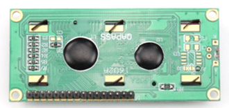
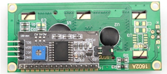

##############################################################################
Chapter LCD1602
##############################################################################

In the previous chapter, we have used the LED matrix to display images and characters. Now, let us use a screen module LCD1602 with a higher resolution to display more content.

There are multiple versions of LCD1602. Your purchase may be one of the following:

.. list-table:: 
    :width: 100%
    :align: center

    *   -   LCD1602

            Please choose “Chapter 16A LCD1602”

        -   I2C LCD1602

            Please choose “Chapter 16B I2C LCD1602”

    *   -   |Chapter16_00|
        -   |Chapter16_01|

There is a conversion module on the back of the I2C LCD1602 module. Convert parallel interface to I2C serial interface. Although they have different interfaces, their functions are the same.

.. note::
    
    Please select the corresponding chapter according to your model.
