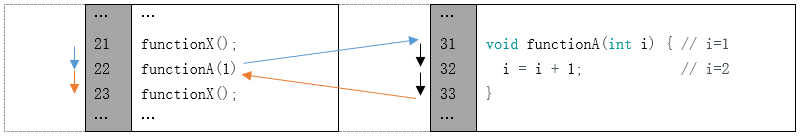
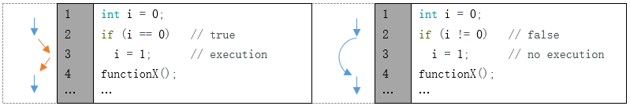
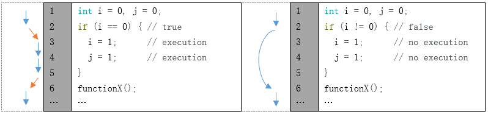
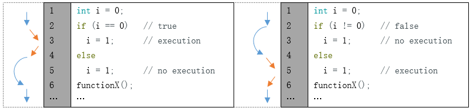
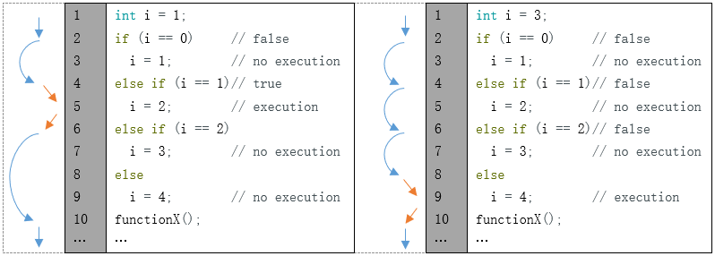
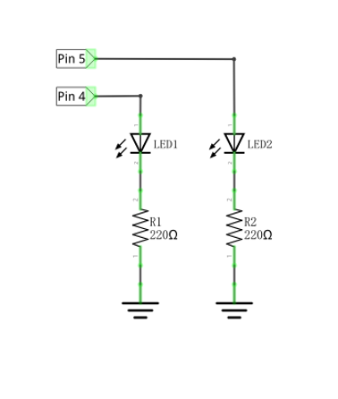
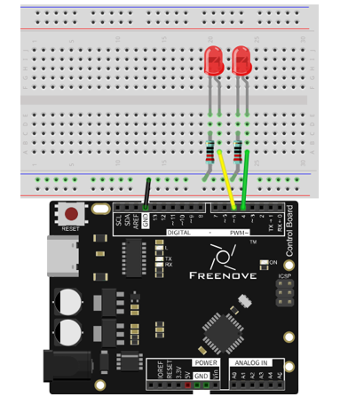
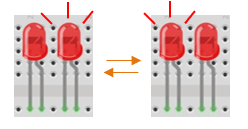

##############################################################################
Chapter Two LEDs Blink
##############################################################################

In last chapter, we have already written code to make 1 LED blink on the control board. And now, we will try to make 2 LEDs blink for further programming study.

Project Two LEDs Blink
***************************************************************

Now, try to make two LEDs blink on control board.

Component List
===============================================================

+-----------------------------------+---------------------------------------+
| Control board x1                  |  Breadboard x1                        |
|                                   |                                       |
|  |Chapter01_00|                   |   |Chapter01_01|                      |
+-----------------------------------+-------------------+-------------------+
| USB cable x1                      | LED x2            | Resistor 220Ω x1  |
|                                   |                   |                   |
|  |Chapter01_02|                   |  |Chapter01_03|   |  |Chapter01_04|   |
+-----------------------------------+                   |                   |
| Jumper M/M x3                     |                   |                   |
|                                   |                   |                   |
|  |Chapter01_06|                   |                   |                   |
+-----------------------------------+-------------------+-------------------+

.. |Chapter01_00| image:: ../_static/imgs/1_LED_Blink/Chapter01_00.png
.. |Chapter01_01| image:: ../_static/imgs/1_LED_Blink/Chapter01_01.png
    :width: 85%
.. |Chapter01_02| image:: ../_static/imgs/1_LED_Blink/Chapter01_02.png
.. |Chapter01_03| image:: ../_static/imgs/1_LED_Blink/Chapter01_03.png
.. |Chapter01_04| image:: ../_static/imgs/1_LED_Blink/Chapter01_04.png
.. |Chapter01_06| image:: ../_static/imgs/1_LED_Blink/Chapter01_06.png

Code Knowledge
===============================================================

In the last chapter, we have taken a brief look at programming. Now let us learn more about the basic programming knowledge.

Parameters of function
---------------------------------------------------------------

In the last chapter, we have used a function with a parameter, such as:

.. code-block:: c

    delay(1000);              // wait for a second

Next, we will define a function with a parameter as below:

.. code-block:: c
    
    void functionA(int i) {
        i = i + 1;
    }

"i" is the parameter of this function. "int" is the type of i. When calling this function, it is necessary to enter the parameter of int type:

.. code-block:: c

    functionA(1);

The input parameter will be assigned to "i" and involved in the calculation of the functionA(int i):

A function can define more than one parameter and the type of the parameters can be different:

.. code-block:: c

    void functionB(int i, char j) {
        char k = 'a';
        i = i + 1;
        k = j;
    }

Boolean data type
---------------------------------------------------------------

Data of Boolean type can only be assigned to "true" or "false".

"true" generally represents a certain relationship which is tenable and correct, and "false" is the opposite.

.. code-block:: c

    boolean isTrue;
    isTrue = true;            // after the execution, "isTrue" is assigned to true.
    isTrue = false;           // after the execution, "isTrue" is assigned to false.

In the code, the number 0 can be considered to be false, and nonzero numbers can be considered true.

Logical operator
---------------------------------------------------------------

The logic operators have "&&" (and), "||" (or), "!" (non), and the calculation object of them are boolean type. The result of logic operation is as follows:

.. list-table:: 
    :width: 20%
    :widths: 1 1 1
    :align: center

    *   -   :orange:`&&`
        -   :orange:`true`
        -   :orange:`false`

    *   -   :orange:`true`
        -   **true**
        -   **false**

    *   -   :orange:`false`
        -   **false**
        -   **false**

.. list-table:: 
    :width: 20%
    :widths: 1 1 1
    :align: center

    *   -   :orange:`||`
        -   :orange:`true`
        -   :orange:`false`

    *   -   :orange:`true`
        -   **true**
        -   **true**

    *   -   :orange:`false`
        -   **true**
        -   **false**

.. list-table:: 
    :width: 20%
    :widths: 1 1
    :align: center

    *   -   :orange:`!`
        -   

    *   -   :orange:`true`
        -   **false**

    *   -   :orange:`false`
        -   **true**

For example:

.. code-block:: c

    boolean isTrue;
    isTrue = true && false;   // after the execution, "isTrue"is assigned to false.
    isTrue = true || false;   // after the execution, "isTrue"is assigned to true.
    isTrue = !true;           // after the execution, "isTrue"is assigned to false.

Relation operator
---------------------------------------------------------------

Relational operator is used to judge whether the relationship of the two amount is tenable and correct. If the relationship is tenable, the result is true. Otherwise, the result is false.

For example, the results of "1<2" is true and the result of "1>2" is false:

.. code-block:: c

    boolean isTrue;
    isTrue = 1 < 2;           // after the execution, "isTrue"is true.
    isTrue = 1 > 2;           // after the execution, "isTrue"is false.

There are other relational operators such as "==" (equal to), ">=" (greater than or equal to), "<=" (less than or equal to) and "!=" (not equal to).

Conditional statement
---------------------------------------------------------------

Conditional statements are used to decide whether or not to execute the program based on the result of judgment statement.

When there are many statements needed to be executed, we can put them into "{}":

Only the section of code in which conditions are tenable will be executed:

In addition, it can judge multiple conditions.

Circuit
===============================================================

Use pin 4 and pin 5 of the control board to drive these two LEDs respectively.

.. list-table:: 
    :width: 100%
    :align: center

    *   -   Schematic diagram
        -   Hardware connection
    
    *   -   |Chapter02_05|
        -   |Chapter02_06|
  

Sketch
===============================================================

In order to show the difference between using function and not using function, we will write two different sketches to make two LEDs blink.

Sketch 2.1.1
---------------------------------------------------------------

At first, use sketch without function to make two LEDs blink alternatively.

.. literalinclude:: ../../../freenove_17_Kit/Sketches/Sketch_2.1.1_Two_LEDs_Blink/Sketch_2.1.1_Two_LEDs_Blink.ino
    :linenos: 
    :language: c

This section of code is similar to the previous section. The difference is that the amount of LEDs is two, and the two LEDs blink alternatively.

.. list-table:: 
    :width: 100%
    :align: center

    *   -   :orange:`Variable scope`
    
    *   -   In the 2nd and 3rd rows of the code above, we define two variables to store the pin number. These two 
         
            variables defined outside the function are called "Global variable", which can be called by all other 
            
            functions. Variables defined inside a function is called "local variable", which can be called only 
            
            by the current function. When local variables and global variables have same names, the global variable
            
            is inaccessible within the function.

Verify and upload the code, then you will see the two LEDs blink alternatively.

Sketch 2.1.2
---------------------------------------------------------------

In the last sketch, we can see that the following two sections of the code are similar, so we will use one function to replace them to simplify the code.

.. code-block:: c

    digitalWrite(led1Pin, HIGH);   // turn the LED1 on
    digitalWrite(led2Pin, LOW);    // turn the LED2 off
    delay(1000);     

.. code-block:: c

    digitalWrite(led1Pin, LOW);    // turn the LED1 off
    digitalWrite(led2Pin, HIGH);   // turn the LED2 on
    delay(1000);                   // wait for a second

Now, we will use a function to improve the above code.

.. literalinclude:: ../../../freenove_17_Kit/Sketches/Sketch_2.1.2_Two_LEDs_Blink/Sketch_2.1.2_Two_LEDs_Blink.ino
    :linenos: 
    :language: c

In the sketch above, we integrate the 2 LED statements into one function, void setLed(int led1, int led2), and control two LEDs through the parameters led1 and led2.

.. literalinclude:: ../../../freenove_17_Kit/Sketches/Sketch_2.1.2_Two_LEDs_Blink/Sketch_2.1.2_Two_LEDs_Blink.ino
    :linenos: 
    :language: c
    :lines: 24-28

When the function above is called, we will control the two LEDs by using different parameters as below.

.. code-block:: c

    setLed(HIGH, LOW);      // set LED1 on, and LED2 off.
    setLed(LOW, HIGH);      // set LED1 off, and LED2 on.

Verify and upload the code, then you will see the two LEDs blink alternatively.

.. list-table:: 
    :width: 100%
    :align: center

    *   -   :orange:`HIGH and LOW`
    
    *   -   **The macro is an identifier that represents a number, a statement, or a piece of code. HIGH and LOW are**
        
            two macros. HIGH and LOW are defined in Arduino IDE as below:
             #define HIGH 1 

             #define LOW 0
            
            In the code, a macro is used as the content defined by itself. For example,
            
            setLed (HIGH, LOW) is equivalent to setLed (1, 0).
    
            Using macros can simplify the code and enhance its readability, such as INPUT, OUTPUT.

Sketch 2.1.3
---------------------------------------------------------------

In the previous section of code, we used a function that integrates two similar paragraphs of code. And we control two LEDs to blink alternatively by using two parameters. Now, let us try to use one parameter to control these two LEDs, which is achieved by conditional statements.

Now, we'll use conditional statement to improve the code above.

.. literalinclude:: ../../../freenove_17_Kit/Sketches/Sketch_2.1.3_Two_LEDs_Blink/Sketch_2.1.3_Two_LEDs_Blink.ino
    :linenos: 
    :language: c

Here, we rewrite the function so that we only need to set the state of LED1, and the state of LED2 can be set automatically.

Verify and upload the code, and then two LEDs blink alternatively.