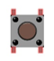
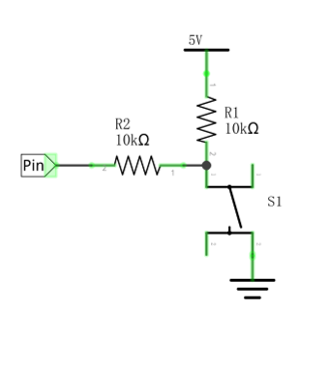
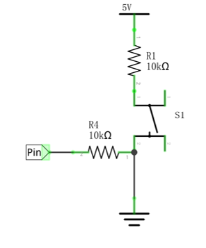
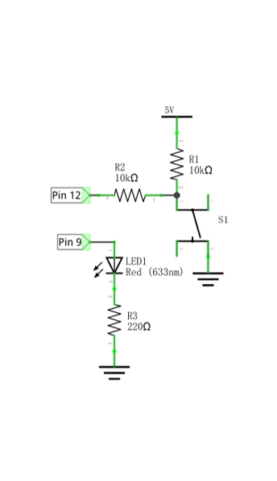
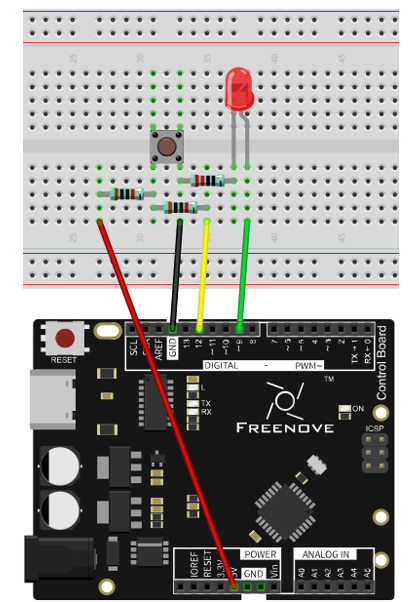
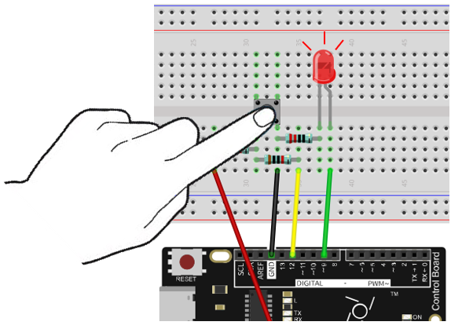
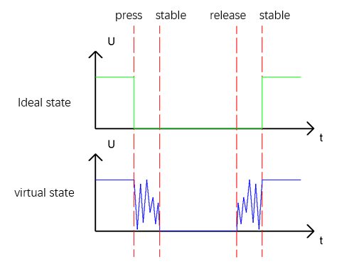

##############################################################################
Chapter Control LED with Push Button Switch
##############################################################################

In the previous chapter, we have used the control board to output signals to make 10 LEDs flash, and make one LED emit different brightness. Now, let's learn how to get an input signal.

Project Control LED with Push Button Switch
***************************************************************

We will use the control board to get the status of the push button switch, and show it through LED.

Component List
===============================================================

+-----------------------------------+----------------------------------------------------------------------------+
| Control board x1                  |  Breadboard x1                                                             |
|                                   |                                                                            |
|  |Chapter01_00|                   |   |Chapter01_01|                                                           |
+-----------------------------------+-------------------+------------------+------------------+------------------+
| USB cable x1                      | LED x1            | Resistor         | Resistor         | Push button x1   |
|                                   |                   |                  |                  |                  |
|  |Chapter01_02|                   |  |Chapter01_03|   | 220Ω x1          | 10kΩ x2          | |Chapter01_05|   |
+-----------------------------------+                   |                  |                  |                  |
| Jumper M/M x2                     |                   |  |Chapter01_04|  | |Chapter05_00|   |                  |
|                                   |                   |                  |                  |                  |
|  |Chapter01_06|                   |                   |                  |                  |                  |
+-----------------------------------+-------------------+------------------+------------------+------------------+

.. |Chapter01_00| image:: ../_static/imgs/1_LED_Blink/Chapter01_00.png
.. |Chapter01_01| image:: ../_static/imgs/1_LED_Blink/Chapter01_01.png
    :width: 55%
.. |Chapter01_02| image:: ../_static/imgs/1_LED_Blink/Chapter01_02.png
.. |Chapter01_03| image:: ../_static/imgs/1_LED_Blink/Chapter01_03.png
.. |Chapter01_04| image:: ../_static/imgs/1_LED_Blink/Chapter01_04.png
    :width: 75%

.. |Chapter01_06| image:: ../_static/imgs/1_LED_Blink/Chapter01_06.png
.. |Chapter05_00| image:: ../_static/imgs/5_Control_LED/Chapter05_00.png
    :width: 30%

Circuit Knowledge
===============================================================

Connection of Push Button Switch

In Chapter 1, we connect push button switch directly to power up the circuit to control the LED to turn on or off. In digital circuits, we need to use the push button switch as an input signal. The recommended connection is as follows:

In the above circuit diagram, when the button is not pressed, 5V (high level) will be detected by control board port; and 0V (low level) when the button is pressed. The role of Resistor R2 here is to prevent the port from being set to output high level by accident. Without R2, the port could be connected directly to the cathode and cause a short circuit when the button is pressed.

The following diagram shows another connection, in which the level detected by the control board port is opposite to the above diagram, whenever the button is pressed or not.

Circuit
===============================================================

Use pin 12 of control board to detect the status of push button, and pin 9 to drive LED. 

.. list-table:: 
    :width: 100%
    :align: center

    *   -   Schematic diagram
        -   Hardware connectionS

    *   -   |Chapter05_02|
        -   |Chapter05_03|

Sketch
===============================================================

Now, write code to detect the state of push button, and show it through LED.

.. literalinclude:: ../../../freenove_17_Kit/Sketches/Sketch_5.1.1_Control_LED_Through_Push_Button/Sketch_5.1.1_Control_LED_Through_Push_Button.ino
    :linenos: 
    :language: c

After the port is initialized, the LED will be turned on or off in accordance with the state of the pin connected to push button switch.

.. list-table:: 
    :width: 50%
    :align: center

    *   -   :orange:`digitalRead(pin)`
    *   -   Arduino IDE provides a function digitalRead(pin) to obtain the state of the port pin. The return value is

            HIGH or LOW, that is, high level or low level.   

Verify and upload the code, press the button, LED lights up; release the button, LED lights off.

Project Change LED State with Push Button Switch
***************************************************************

In the previous section, we have finished the experiment that LED lights ON when push button switch is pressed, and lights OFF as soon as it's released. Now, let's try something new: each time you press the button down, the state of LED will be changed.

Component List
===============================================================

Same with the previous section.

Circuit Knowledge
===============================================================

Debounce a push button switch
---------------------------------------------------------------

When a Momentary Push Button Switch is pressed, it will not change from one state to another state immediately. Due to tiny mechanical vibrations, there will be a short period of continuous buffeting before it stabilizes in a new state too fast for Humans to detect but not for computer microcontrollers. The same is true when the push button switch is released. This unwanted phenomenon is known as “bounce”.

Therefore, if we can directly detect the state of the Push Button Switch, there are multiple pressing and releasing actions in one pressing cycle. This buffeting will mislead the high-speed operation of the microcontroller to cause many false decisions. Therefore, we need to eliminate the impact of buffeting. Our solution: to judge the state of the button multiple times. Only when the button state is stable (consistent) over a period of time, can it indicate that the button is actually in the ON state (being pressed).

Circuit
===============================================================

Same with the previous section.

Sketch
===============================================================

Sketch 5.2.1
---------------------------------------------------------------

Now, write a code to detect the state of the push button switch. Every time you pressed it, the state of LED will be changed. 

.. literalinclude:: ../../../freenove_17_Kit/Sketches/Sketch_5.2.1_Change_LED_State_by_Push_Button/Sketch_5.2.1_Change_LED_State_by_Push_Button.ino
    :linenos: 
    :language: c

Verify and upload the code, then each time you press the button, LED changes its state accordingly.

When judging the push button switch state, if it is detected as "pressed down", wait for a certain time to detect again to eliminate the effect of bounce. When the state is stable, released push button switch, and wait for a certain time to eliminate the effect of bounce after it is released.

